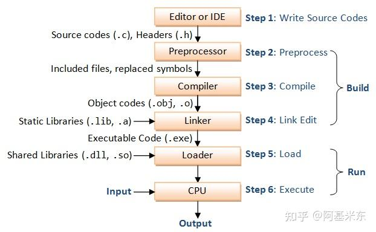

# GCC

> 注意根据自己的文件夹调整命令

## 安装

```shell
sudo apt install gcc
sudo apt-get install gcc
```

## 过程

预处理---->编译---->汇编---->链接

hello.c---->hello.i---->hello.s---->hello.o---->hello

> 其中前三个是文本，后两个是二进制



## 命令

```shell
gcc  选项  参数
g++  选项  参数
```

## 常用选项

```shell

-o #产生目标，指定输出文件名

-x #使后缀名无效

-E #只激活预处理

-S #只激活预处理和编译，就是指把文件编译成为汇编代码

-c #只激活预处理,编译,和汇编

-lLIBRARY #链接时搜索指定的函数库LIBRARY

-Ldir #搜索库的目录路径

-I(大写的i) #用来指定头文件目录

-shared #创建共享库/动态库

-static #使用静态库，禁用动态库

-std=c++11 #设置c++标准，g++的选项

-Wall #打印警告信息

-w #关闭警告信息

```

> GCC = GNU Compiler Collection
> GCC 可同时用来编译 C 程序和 C++ 程序
> GCC 包括gcc和g++
> gcc命令只能用来编译C程序
> g++命令用来编译C++程序
> g++ = gcc -xc++ -lstdc++ -shared-libgcc

## 常见后缀及其含义

| 后缀 | 含义 |
|-----|------|
|.c|C源文件|
|.s/.S|汇编语言源文件|
|.C/.cc/.cxx/.cpp|C++ 源文件|
|.o/.obj|目标文件|
|.h|C/C++ 头文件|
|.a/.lib|静态库|
|.i/.ii|经过预处理的 C/C++ 文件|
|.so/.dll|动态库|

***

## 基本使用

### 分步进行

文件夹GCC/A

```shell

#预处理
gcc -E main.c -o main.i

#编译
gcc -S main.i -o main.s

gcc -S main.c -o main.s  #与上面的命令等价
#汇编
gcc -c main.s -o mian.o

gcc -c main.c -o mian.o  #与上面的命令等价

#链接（没有使用到库）
gcc main.o -o main.out
gcc main.o -o main

```

### 一次结束

文件夹GCC/A

```shell
gcc main.c -o main
```

***

## 头文件

文件夹GCC/B

```shell
gcc main.c src/hello.c -I include/ -o main

```

***

## 库

## 命名规则

1：静态库的名字一般为libxxx.a，其中 xxx是该lib的名称

2：动态库的名字一般为libxxx.so.major.minor，xxx是该lib的名称，major是主版本号，minor是副版本号

### 创建静态库

文件夹GCC/C

> 静态链接库是obj文件的集合，通常以“.a”为后缀，名字格式一般为libXXX.a
> 静态库是在程序整个编译过程中链接的


```shell
#生成.o文件
gcc -c src/hello_c.c -o lib/hello_c.o -Iinclude

#归档  首先要进入lib文件夹
ar -cr libhello_c.a hello_c.o

```

### 使用静态库

需要libXXX.a和.h文件

注意切换文件夹

```shell
gcc main.c -o main -Llib/ -lhello_c -Iinclude/
```

***

### 创建动态库

文件夹 GCC/D

```shell
#生成.o文件
gcc -fPIC -c src/hello_c.c -o lib/hello_c.o -Iinclude/

#生成动态库  注意根据文件夹自己调整命令
gcc -shared lib/hello_c.o -o lib/libhello_c.so
```

### 使用动态库

文件夹 GCC/D

```shell
gcc main.c -o main -Llib/ -lhello_c -Iinclude/

ldd main
```

> 找不到共享库的解决方法
1: 在编译目标代码时指定该程序的动态库搜索路径
2: 设置环境变量 LD_LIBRARY_PATH
3: 在配置文件/etc/ld.so.conf中指定动态库搜索路径
4: 共享库添加到系统路径

```shell
gcc main.c -o main -Llib/ -lhello_c -Iinclude/ -Wl,-rpath=lib/

# -Wl, 表示后面的参数将传给 link 程序 ld （因为 gcc 可能会自动调用ld ）
# 参数 "-Wl,-rpath=" 当指定多个动态库搜索路径时，路径之间用冒号 ":" 分隔
```

## 库文件的搜索路径及顺序

### 静态库

1: gcc/g++命令中的参数-L
2: gcc的环境变量LIBRARY_PATH
3: 默认库目录/lib和/lib64、/usr/lib 和/usr/lib64、/usr/local/lib和/usr/local/lib64

### 动态库

1: 编译目标代码时指定的动态库搜索路径
2: 环境变量LD_LIBRARY_PATH指定动态库搜索路径
3: 配置文件/etc/ld.so.conf中指定的动态库搜索路径
4: 默认库目录/lib和/lib64、/usr/lib 和/usr/lib64、/usr/local/lib和/usr/local/lib64

## 交叉编译

编译器和目标程序运行在不同架构的编译过程，称为交叉编译

例如：在x86平台上面编译程序，使该程序可以在ARM架构上面运行

```shell
# 安装ARM-GCC
 sudo apt install gcc-arm-linux-gnueabihf

# 编译
 arm-linux-gnueabihf-gcc hello.c –o hello_arm

# 运行
 readelf -a hello_arm

```

### GCC编译器的命名格式

```shell
arch [-os] [-(gnu)eabi(hf)] -gcc
```

|字段|含义|
|---|---|
|arch|目标芯片架构|
|os|操作系统|
|gnu|C标准库类型|
|eabi|应用二进制接口|
|hf|浮点模式|

### arm-linux-gnueabihf-gcc

- arm：表示它的目标芯片架构为ARM
- linux：目标操作系统为Linux
- gnu：使用GNU的C标准库即glibc
- eabi：使用嵌入式应用二进制接口（eabi）
- hf：编译器的浮点模式为硬浮点hard-float

## makefile

### 是什么

> Makefile 文件描述了 Linux 系统下 C/C++ 工程的编译规则
> 它用来自动化编译 C/C++ 项目
> 一旦写编写好 Makefile 文件
> 只需要一个 make 命令
> 整个工程就开始自动编译
> 不再需要手动执行 GCC 命令

### 规则

```makefile
#规则
targets : prerequisites
    command

1.targets是目标
2.prerequisites是依赖文件
3.command是命令

#例如
main: main.cpp
    g++ main.cpp -o main
```
