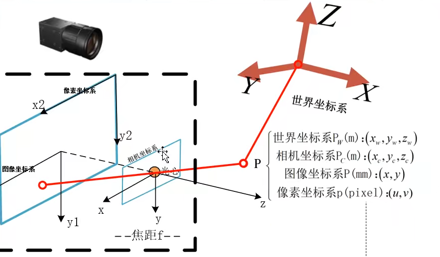
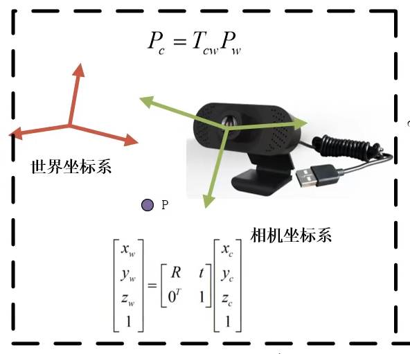
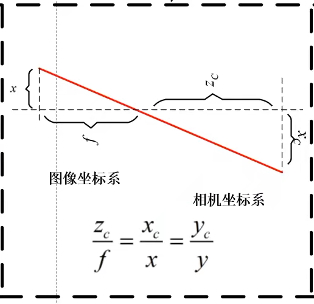
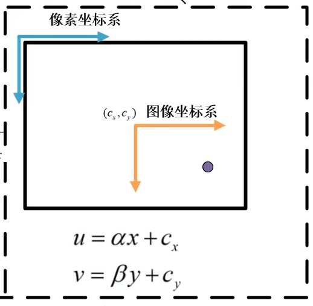
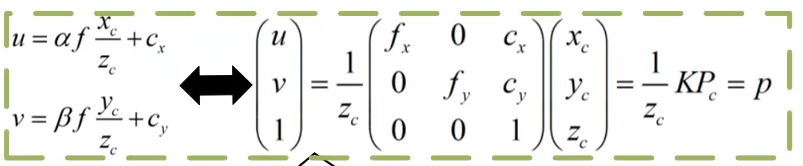
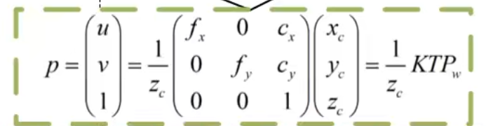
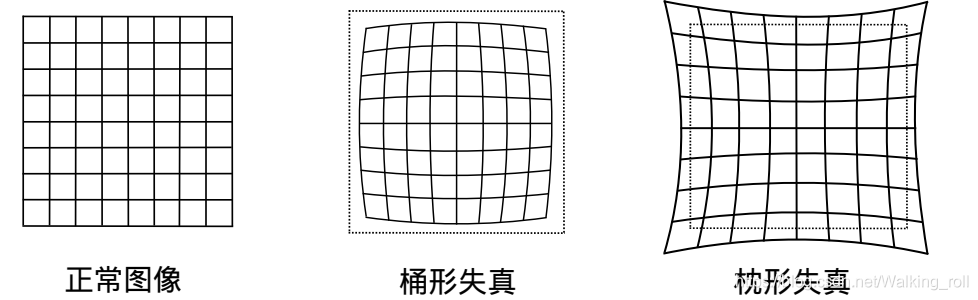
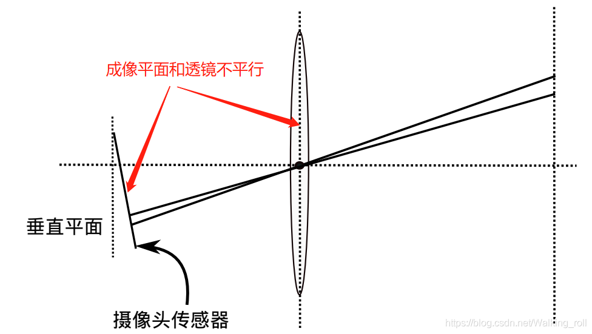

# 视觉

## 相机模型

> 空间中的一个点，在不同的坐标系下，坐标值是不一样的
---
> 以四个坐标系观测这个点，会得到不同的坐标位置，并且不同的坐标位置存在着一定的关系

## 补充知识

- 绝对坐标系：不依托于其他任何物体，在**指定后不变且唯一**
- 相对坐标系：依托于某物体的空间位置、旋转角度而定义的坐标系，会**随着物体移动发生变化**

## 世界坐标系(三维)

$$
P_w(m):(x_w,y_w,z_w)
$$

>世界坐标系是假想坐标系，可以被任意选取。空间中的任意一点都可被选取为世界坐标系的原点

在被指定后随即 不变且唯一，即为**绝对坐标系**

[为什么需要世界坐标系？世界坐标系的选取](https://zhuanlan.zhihu.com/p/346131786)

## 相机坐标系(三维)

$$
P_c(m):(x_c,y_c,z_c)
$$

相机坐标系**以相机的光心（小孔）作为原点**，X轴为水平方向，Y轴为竖直方向，Z轴指向相机所观察的方向，其随相机的移动而变化，即为**相对坐标系**

## 图像坐标系(二维)

$$
P(mm):(x,y)
$$

>主光轴和图像平面交点为坐标原点。暂认为是图像中心为原点(不准确)

依托于相机坐标系，故也为**相对坐标系**

## 像素坐标系(二维)

$$
p(pixel):(u,v)
$$

图像左上顶点为原点，**单位是像素**

依托于图像物体坐标系，同样是**相对坐标系**

## 坐标系变换

### 成像流程

外部实体---->世界坐标系---->相机坐标系---->图像坐标系---->像素坐标系

### 世界->相机

> 旋转+平移

三维空间中，当物体不发生形变时，对一个几何物体作旋转R， 平移t的运动，称之为**刚体变换**

因为R和t与相机无关，所有又称其为**相机外参**

> 借助这个模型，我们可以求出**实物**与**相机**之间的相对姿态（比赛中即对手车辆与我方车辆的相对姿态）

### 相机->图像

### 图像->像素

$$
$$

### 相机->像素(相机模型)

K是**内参矩阵**（标定）

fx:水平缩放因子
fy:垂直缩放因子
cx:水平平移因子
cy:垂直平移因子

$1/z_c可省略$

相机内参=内参矩阵+畸变参数矩阵

### 世界->像素(全流程)

## 畸变

产生原因：

- 透镜形状：由于透镜形状造成的畸变成为**径向畸变**，径向畸变分为桶形畸变和枕形畸变
- 安装误差：相机安装过程中由于不能使透镜和成像平面严格平行造成的畸变称为**切向畸变**

## 相机标定

> 求相机内参的过程，被称为相机标定

标定方法：张正又棋盘标定法
