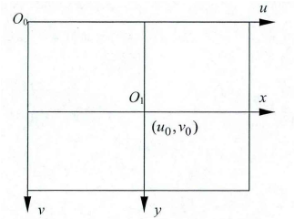
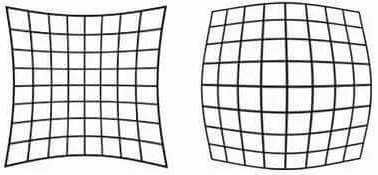
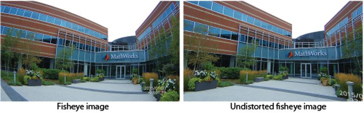
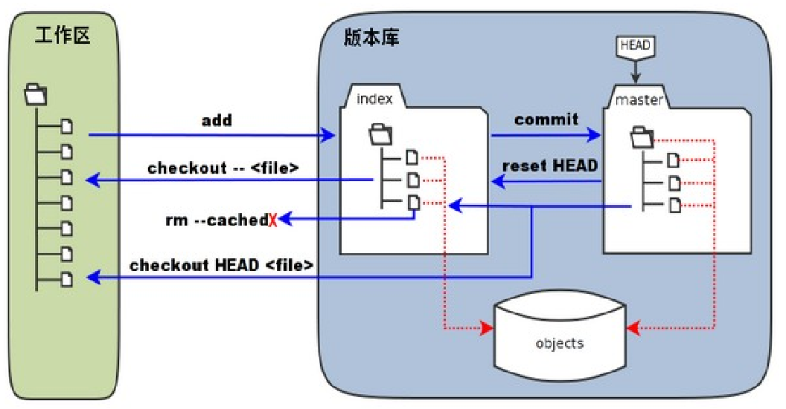
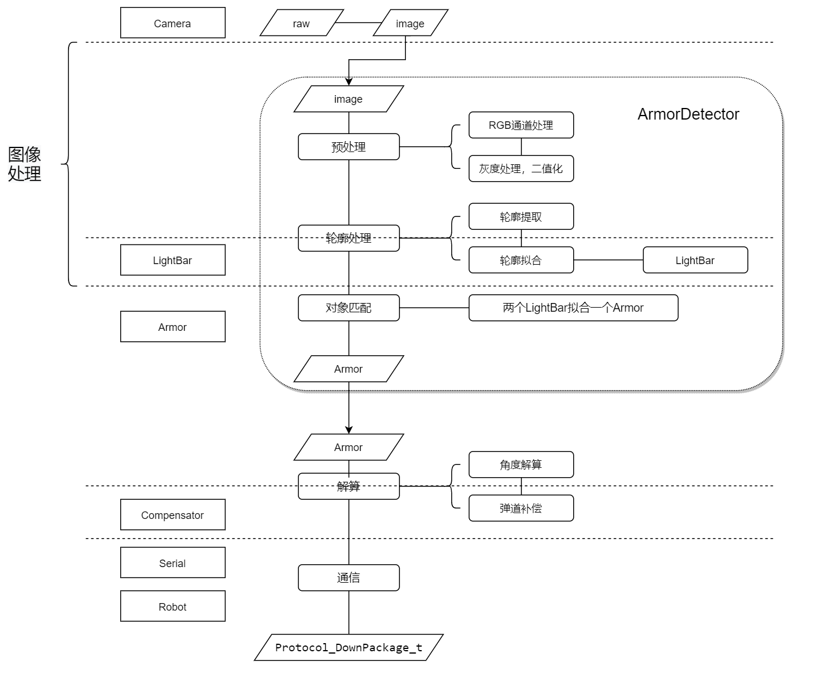
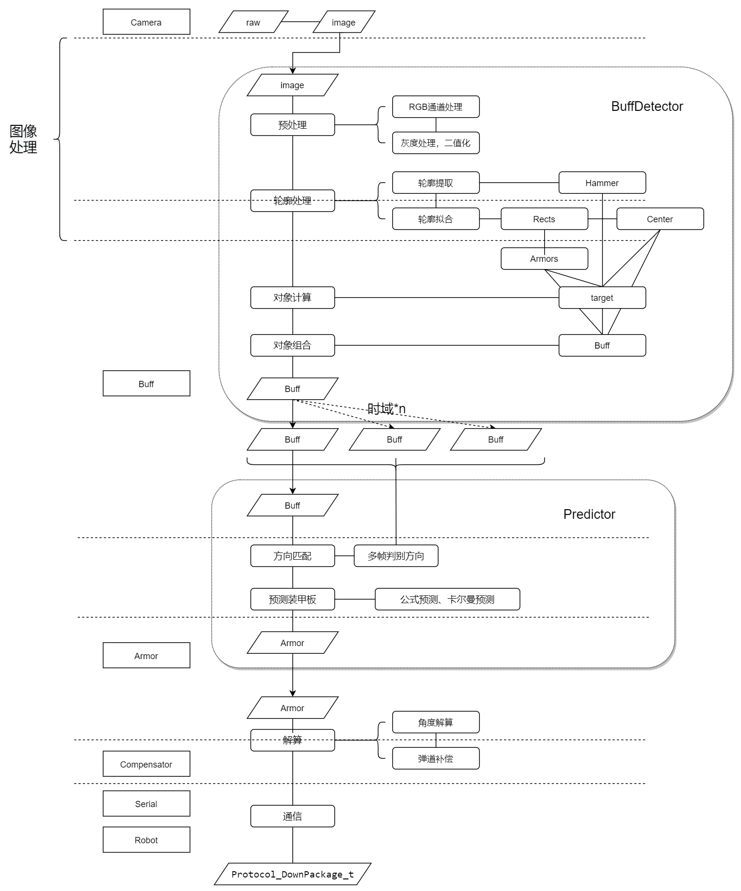

# QDU-RM-AI学习手册

## 序言

### 写在前面的话

本手册内容基于2021赛季青岛大学robomaster未来战队算法组学习内容进行撰写，参考算法组培训人员学习笔记。如有纰漏请联系笔者（QQ：3130676972）

### 开源仓库

[Gitee](https://gitee.com/qsheeeeen/qdu-rm-ai.git)

[Github](https://github.com/qsheeeeen/qdu-rm-ai.git)

### Reference

浙江大学Hello World战队18年视觉开源代码

吉林大学TARS_GO战队19年视觉开源代码

[OpenCV官方使用手册](www.doc.opencv.org)

### 版本

| 版本 | 详细信息                                        |
| ---- | ----------------------------------------------- |
| v1.0 | 结束OpenCV部分内容编写和基础的Git与算法部分编写 |

## 目录

[TOC]


## 内容

### 一、OpenCV相关知识

> OpenCV，OpenCV Computer Vision，是开源计算机视觉库。底层通过C语言实现，C++提供更为简便的接口和运算过程。OpenCV提供了C++，Python，MATLAB，Java，Android等语言版本，在此使用C++版本进行叙述
>
> 注：此篇章例程均为OpenCV官方所给出示例，不符合qdu-rm-ai编码规范
>
>
> | 章节                      | 主要参考文件                   |
> | ------------------------- | ------------------------------ |
> | 1. 基础类型与图像视频读取 | `imgcodecs.hpp`、`videoio.hpp` |
> | 2. 图像显示与GUI界面      | `highgui.hpp`                  |
> | 3. 图像色彩学             | `imgproc.hpp`                  |
> | 4. 图像几何学             | `core.hpp`                     |
> | 5, 图像形态学             | `imgproc.hpp`                  |
> | 6. 图像轮廓处理           | `imgproc.hpp`                  |
> | 7. 映射变换               | `imgproc.hpp`                  |
> | 8. 绘图函数               | `imgproc.hpp`                  |
> | 9. 空间位置解算           | `calib3d.hpp`                  |
> | 10. 相机标定              | `calib3d.hpp`                  |
>

#### 1. 基础类型与图像视频读取

> #### 1.  基础类型
>
> 1. ##### 接口类
>
>    这些类，让OpenCV在大部分时候提供了隐式转换，大多数类型，如：
>    `Mat` `Mat_<T>` `Matx<T m n>` `std::vector<T>` `std::vector<std::vector<T> >` `std::vector<Mat>` `std::vector<Mat_<T> >` `UMat` `std::vector<UMat>` `double`
>    这些类通过调用 `InputArray` 来进行隐式转换，方便使用
>
>    | 类型                       | 说明                                                         |
>    | :------------------------- | :----------------------------------------------------------- |
>    | `InputArray`               | 只读输入数组传递到 OpenCV 函数的代理类                       |
>    | `OutputArray`              | 这种类型与 `InputArray` 非常相似，只是它用于输入/输出和输出函数参数 |
>    | `InputOutputArray`         | typedef `OutputArray` `InputArrayOfArrays`                   |
>    | `InputArrayOfArrays`       | typedef `InputArray` `InputArrayOfArrays`                    |
>    | `OutputArrayOfArrays`      | typedef  `OutputArray` `OutputArrayOfArrays`                 |
>    | `InputOutputArrayOfArrays` | typedef  `OutputArray` `InputOutputArrayOfArrays`            |
>
>
> 2. ##### Mat  图像类
>
>    ` Mat`本质是一个n维密集运算数组，相似的有`UMat`，表示GPU Mat
>
>
> 3. ##### 运算类
>
>    OpenCV的运算内核原型类，详情见 `<opencv2/core/matx.hpp>`
>
>    | 类型   | 说明   |
>    | ------ | ------ |
>    | `Matx` | 矩阵类 |
>    | `Vec`  | 向量类 |
>
> 4. ##### 定义类
>
>    这是OpenCV官方定义的一些常用的类型，详情见`<opencv2/core/types.hpp>`
>
>    | 类型          | 说明       |
>    | ------------- | ---------- |
>    | `Point`       | 二维点类   |
>    | `Point3`      | 三维点类   |
>    | `Rect`        | 矩形类     |
>    | `RotatedRect` | 旋转矩形类 |
>    | `Range`       | 范围类     |
>    | `Scalar`      | 通道类     |
>    | `Size`        | 规格类     |
>
> 
>
> #### 	2.  图像视频IO
>
>
>    1. 函数
>
>       1. imread
>
>          ```C++
>          Mat cv::imread (	const String & 	filename, 
>          					int				flags = IMREAD_COLOR
>                         )	
>          /*
>          @brief Loads an image from a file.
>          简介 从文件加载图像。
>          
>          The function imread loads an image from the specified file and returns it. If the image cannot be read (because of missing file, improper permissions, unsupported or invalid format), the function returns an empty matrix ( Mat::data==NULL ).
>          函数imread从指定文件加载图像并返回。如果无法读取图像（由于缺少文件、权限不正确、格式不受支持或无效），函数将返回一个空矩阵（Mat::data==NULL）。
>          
>          @param filename Name of file to be loaded.
>          @param flags Flag that can take values of cv::ImreadModes
>          */
>          ```
>
>         2. imwrite
>
>            ```C++
>            bool cv::imwrite	(	const String & 				filename,
>            						InputArray 					img,
>            						const std::vector< int > & 	params = std::vector< int >() 
>            					)	
>            /*
>            @brief Saves an image to a specified file.
>            简介 将图像保存到指定文件。
>                                                                   
>            The function imwrite saves the image to the specified file. The image format is chosen based on the filename extension (see cv::imread for the list of extensions). In general, only 8-bit single-channel or 3-channel (with 'BGR' channel order) images can be saved using this function
>            imwrite函数将图像保存到指定的文件中。根据文件扩展名选择图像格式（有关扩展名列表，请参阅cv::imread）。通常，使用此功能只能保存8位单通道或3通道（具有“BGR”通道顺序）图像
>                                                                   
>            @param filename Name of the file.
>            @param img (Mat or vector of Mat) Image or Images to be saved.
>            @param params Format-specific parameters encoded as pairs (paramId_1, paramValue_1, paramId_2, paramValue_2, ... .) see cv::ImwriteFlags
>            */
>            ```
>
>    2. 类
>
>        1. `VideoCapture`
>
>           ```C++
>           // 常用函数
>            				VideoCapture (const String &filename, int apiPreference=CAP_ANY) 
>            				VideoCapture (int index, int apiPreference=CAP_ANY)
>
>           virtual bool 	open (const String &filename, int apiPreference=CAP_ANY)
>           virtual bool 	open (int index, int apiPreference=CAP_ANY)
>           virtual bool 	isOpened () const
>
>           virtual double 	get (int propId) const
>           virtual bool 	set (int propId, double value)
>
>           virtual void 	read ()
>           virtual void 	release ()
>
>           virtual VideoCapture & 	operator>> (const Mat &image)
>           ```
>
>           ```C++
>           #include <opencv2/core.hpp>
>           #include <opencv2/videoio.hpp>
>           #include <opencv2/highgui.hpp>
>           #include <iostream>
>           #include <stdio.h>
>           using namespace cv;
>           using namespace std;
>           int main(int, char**)
>           {
>               Mat frame;
>               //--- INITIALIZE VIDEOCAPTURE
>               VideoCapture cap;
>               // open the default camera using default API
>               // cap.open(0);
>               // OR advance usage: select any API backend
>               int deviceID = 0;             // 0 = open default camera
>               int apiID = cv::CAP_ANY;      // 0 = autodetect default API
>               // open selected camera using selected API
>               cap.open(deviceID, apiID);
>               // check if we succeeded
>               if (!cap.isOpened()) {
>                   cerr << "ERROR! Unable to open camera\n";
>                   return -1;
>               }
>               //--- GRAB AND WRITE LOOP
>               cout << "Start grabbing" << endl
>                   << "Press any key to terminate" << endl;
>               for (;;)
>               {
>                   // wait for a new frame from camera and store it into 'frame'
>                   cap.read(frame);
>                   // check if we succeeded
>                   if (frame.empty()) {
>                       cerr << "ERROR! blank frame grabbed\n";
>                       break;
>                   }
>                   // show live and wait for a key with timeout long enough to show images
>                   imshow("Live", frame);
>                   if (waitKey(5) >= 0)
>                       break;
>               }
>               // the camera will be deinitialized automatically in VideoCapture destructor
>               return 0;
>           }
>           ```
>
>          2. `VideoWriter`
>
>             ```C++
>             //常用函数 
>              				VideoWriter (const String &filename, int apiPreference, int fourcc, double fps, Size frameSize, bool isColor=true)
>             				//VideoWriter进行了四次有参重载，一次无参重载
>                                                                                                                                                 
>             virtual bool 	isOpened () const
>             virtual bool 	open (const String &filename, int fourcc, double fps, Size frameSize, bool isColor=true)
>             				//open进行了四次重载
>                                                                                                                                                 
>             virtual double 	get (int propId) const
>             virtual bool 	set (int propId, double value)
>                                                                                                                                                 
>             virtual VideoWriter & 	operator<< (const Mat &image)   
>             ```
>
>             ```C++
>             #include <opencv2/core.hpp>
>             #include <opencv2/videoio.hpp>
>             #include <opencv2/highgui.hpp>
>             #include <iostream>
>             #include <stdio.h>
>             using namespace cv;
>             using namespace std;
>             int main(int, char**)
>             {
>                 Mat src;
>                 // use default camera as video source
>                 VideoCapture cap(0);
>                 // check if we succeeded
>                 if (!cap.isOpened()) {
>                     cerr << "ERROR! Unable to open camera\n";
>                     return -1;
>                 }
>                 // get one frame from camera to know frame size and type
>                 cap >> src;
>                 // check if we succeeded
>                 if (src.empty()) {
>                     cerr << "ERROR! blank frame grabbed\n";
>                     return -1;
>                 }
>                 bool isColor = (src.type() == CV_8UC3);
>                 //--- INITIALIZE VIDEOWRITER
>                 VideoWriter writer;
>                 int codec = VideoWriter::fourcc('M', 'J', 'P', 'G');  // select desired codec (must be available at runtime)
>                 double fps = 25.0;                          // framerate of the created video stream
>                 string filename = "./live.avi";             // name of the output video file
>                 writer.open(filename, codec, fps, src.size(), isColor);
>                 // check if we succeeded
>                 if (!writer.isOpened()) {
>                     cerr << "Could not open the output video file for write\n";
>                     return -1;
>                 }
>                 //--- GRAB AND WRITE LOOP
>                 cout << "Writing videofile: " << filename << endl
>                      << "Press any key to terminate" << endl;
>                 for (;;)
>                 {
>                     // check if we succeeded
>                     if (!cap.read(src)) {
>                         cerr << "ERROR! blank frame grabbed\n";
>                         break;
>                     }
>                     // encode the frame into the videofile stream
>                     writer.write(src);
>                     // show live and wait for a key with timeout long enough to show images
>                     imshow("Live", src);
>                     if (waitKey(5) >= 0)
>                         break;
>                 }
>                 // the videofile will be closed and released automatically in VideoWriter destructor
>                 return 0;
>             }  
>             ```
>

#### 	2. 图像显示与GUI

> OpenCV是计算机视觉库，有了图像处理，当然不可或缺的有图像显示和相应的图形界面接口了。
>
> 与GUI有关的函数，有创建窗口、改变窗口大小、创建拖动条、鼠标滚轮响应等等较为全面的函数体系，但是部分需要Qt的环境支持，此处不一一赘述，如有需要请观看手册。
>
> ##### 函数
>
> > ###### 展示图像
>
> > ```C++
> > void cv::imshow	(	const String & 	winname,
> > 					InputArray 	mat 
> > 				)
> > /** 
> > @brief Displays an image in the specified window.
> > 简介 在指定的窗口中显示图像。
> > 
> > The function imshow displays an image in the specified window. If the window was created with the cv::WINDOW_AUTOSIZE flag, the image is shown with its original size, however it is still limited by the screen resolution. Otherwise, the image is scaled to fit the window. The function may scale the image, depending on its depth:
> > imshow函数在指定窗口中显示图像。如果窗口是使用cv::window_AUTOSIZE标志创建的，则图像将以其原始大小显示，但仍受屏幕分辨率的限制。否则，将缩放图像以适应窗口。该功能可根据图像的深度缩放图像：
> > -   If the image is 8-bit unsigned, it is displayed as is.
> > -   If the image is 16-bit unsigned or 32-bit integer, the pixels are divided by 256. That is, the value range [0,255\*256] is mapped to [0,255].
> > -   If the image is 32-bit or 64-bit floating-point, the pixel values are multiplied by 255. That is, the value range [0,1] is mapped to [0,255].
> > -如果图像是8位无符号的，它将按原样显示。
> > -如果图像是16位无符号或32位整数，则像素除以256。也就是说，值范围[0255\*256]映射到[0255]。
> > -如果图像是32位或64位浮点，则像素值乘以255。也就是说，值范围[0,1]映射到[0255]。
> > 
> > If window was created with OpenGL support, cv::imshow also support ogl::Buffer , ogl::Texture2D and cuda::GpuMat as input.
> > If the window was not created before this function, it is assumed creating a window with cv::WINDOW_AUTOSIZE.
> > If you need to show an image that is bigger than the screen resolution, you will need to call namedWindow("", WINDOW_NORMAL) before the imshow.
> > 若窗口是使用OpenGL支持创建的，那个么cv::imshow也支持ogl::Buffer、ogl::Texture2D和cuda::GpuMat作为输入。
> > 如果该窗口不是在此函数之前创建的，则假定使用cv::window\u AUTOSIZE创建窗口。
> > 如果需要显示大于屏幕分辨率的图像，则需要在imshow之前调用namedWindow（“，WINDOW_NORMAL”）。
> > 
> > @note This function should be followed by cv::waitKey function which displays the image for specified milliseconds. Otherwise, it won't display the image. For example, waitKey(0) will display the window infinitely until any keypress (it is suitable for image display). waitKey(25) will display a frame for 25 ms, after which display will be automatically closed. (If you put it in a loop to read videos, it will display the video frame-by-frame)
> > @注意：此函数后面应该是cv::waitKey函数，该函数显示指定毫秒的图像。否则，它将不会显示图像。例如，waitKey（0）将无限显示窗口，直到按任意键为止（适用于图像显示）。waitKey（25）将显示一帧25毫秒，之后显示屏将自动关闭(如果将其放入循环中以读取视频，它将逐帧显示视频）
> > 
> > @note
> > [__Windows Backend Only__] Pressing Ctrl+C will copy the image to the clipboard.
> > [__Windows Backend Only__] Pressing Ctrl+S will show a dialog to save the image.
> > @注
> > 仅限Windows后端 按Ctrl+C将图像复制到剪贴板。
> > 仅限Windows后端 按Ctrl+S将显示一个保存图像的对话框。
> > @param winname Name of the window.
> > @param mat Image to be shown.
> >  */
> > ```
>
> > ###### 键盘响应
>
> > ```C++
> > int cv::waitKey	(	int 	delay = 0	)	
> > /** 
> > @brief Waits for a pressed key.
> > @简短 等待一个按下的键。
> > 
> > The function waitKey waits for a key event infinitely (when delay <= 0 or for delay milliseconds, when it is positive. Since the OS has a minimum time between switching threads, the function will not wait exactly delay ms, it will wait at least delay ms, depending on what else is running on your computer at that time. It returns the code of the pressed key or -1 if no key was pressed before the specified time had elapsed.
> > 函数waitKey无限期地等待一个键事件（当延迟<=0时）或延迟毫秒（当它为正时）。由于操作系统在切换线程之间有一个最小的时间间隔，因此函数不会完全延迟ms，它将至少延迟ms，这取决于当时计算机上运行的其他内容。它返回按下的键的代码，如果在指定时间之前没有按下任何键，则返回-1。
> > 
> > @note
> > This function is the only method in HighGUI that can fetch and handle events, so it needs to be called periodically for normal event processing unless HighGUI is used within an environment that takes care of event processing.
> > 此函数是HighGUI中唯一可以获取和处理事件的方法，因此需要定期调用此函数以进行正常的事件处理，除非在负责事件处理的环境中使用HighGUI。
> > The function only works if there is at least one HighGUI window created and the window is active. If there are several HighGUI windows, any of them can be active.
> > 仅当至少创建了一个HighGUI窗口且该窗口处于活动状态时，该函数才起作用。如果有多个HighGUI窗口，则其中任何一个都可以处于活动状态。
> > 
> > @param delay Delay in milliseconds. 0 is the special value that means "forever".
> >  */
> > ```


####    3. 图像色彩学

> ​		图像色彩处理是基于色彩和色域来进行图像处理。在OpenCV中，每一个图像对象被抽象成为n维矩阵（下面详细叙述），而图像对象可以是一张图片，视频里的某一帧，摄像头读取到的数据流中的一个数据部分，或者人为赋值产生的一个数据矩阵。在opencv-python中，借助了Numpy进行运算，在C++中可以使用Eigen进行运算加速。
>
> |  |
> | :---------------------------------: |
> |            *图像坐标系*             |
>
> ​		将图像用最小单位分割开，可视作lines * columns pixels，即width * height pixels，$image[u] [v]$即是最小元素。此时我们将图像对象扩展成为2维数组，以RGB颜色空间为例，每一个元素的值为一个数值对，即
> $$
> image[u] [v] = (R,G,B)
> $$
> ​		在此基础上，增添C轴，即Channel，通道数。
> $$
> image[u] [v] [c] = X
> $$
> ​		此时图像已经被成为了一个三维数组，便于计算，可以写成一个三维矩阵，第三个维度是通道数，此时只有RGB通道。回顾前文，举例通过RGB颜色空间进行举例，对于OpenCV，有很多颜色通道可以进行处理
> 1. ###### RGB ↔ GRAY
>
>    Transformations within RGB space like adding/removing the alpha channel, reversing the channel order, conversion to/from 16-bit RGB color (R5:G6:B5 or R5:G5:B5), as well as conversion to/from grayscale using:
> $$
> RGB[A] \to\ Gray:Y←0.299⋅R+0.587⋅G+0.114⋅B
> \\
>  Gray \to\ RGB[A]:R←Y,G←Y,B←Y,A←max(ChannelRange)
> $$
> 2. ###### RGB ↔ HSV
>
>    In case of 8-bit and 16-bit images, R, G, and B are converted to the floating-point format and scaled to fit the 0 to 1 range.
>
>
> $$
> V←max(R,G,B)
> \\\\
>    S←
> \left\{
> \begin{matrix}
> \frac{V−min(R,G,B)}{V} &  if\ V≠0,\\
> 0 & otherwise
> \end{matrix}
> \right.
> \\\\
> H=
> \left\{
> \begin{matrix} 
> 60(G−B)/(V−min(R,G,B)) & if\ V=R\\ 
> 120+60(B−R)/(V−min(R,G,B)) & if\ V=G\\
> 240+60(R−G)/(V−min(R,G,B)) & if\ V=B\\
> \end{matrix}
> \right.
> \\\\
> If\ H<0\ then\ H←H+360\ . On\ output\ 0≤V≤1, 0≤S≤1, 0≤H≤360 .
> $$
>    The values are then converted to the destination data type:
>
>    - 8-bit images: $$V←255V,S←255S,H←H/2(to\ fit\ to\ 0\ to\ 255)$$​
>    - 16-bit images: (currently not supported) $$V<−65535V,S<−65535S,H<−H$$
>    - 32-bit images: H, S, and V are left as is
>
> 3. ###### Bayer → RGB
>
>    The Bayer pattern is widely used in CCD and CMOS cameras. It enables you to get color pictures from a single plane where R,G, and B pixels (sensors of a particular component) are interleaved as follows:
>
> 	|  |
> 	| :---------------------------: |
> 	|        *Bayer pattern*        |
>
> 	The output RGB components of a pixel are interpolated from 1, 2, or 4 neighbors of the pixel having the same color. There are several modifications of the above pattern that can be achieved by shifting the pattern one pixel left and/or one pixel up. The two letters *C<sub>1</sub>* and *C<sub>2</sub>* in the conversion constants CV_Bayer *C<sub>1</sub>C<sub>2</sub>* 2BGR and CV_Bayer *C<sub>1</sub>C<sub>2</sub>* 2RGB indicate the particular pattern type. These are components from the second row, second and third columns, respectively. For example, the above pattern has a very popular "BG" type.
>
> 
>
>
> ##### 常用函数
>
> > ###### 二值化函数
>
> > ```C++
> > double cv::threshold	(	InputArray 		src,
> > 							OutputArray 	dst,
> > 							double 			thresh,
> > 							double 			maxval,
> > 							int 			type 
> >                      	)	
> >    /**
> > @brief Applies a fixed-level threshold to each array element.
> > 简洁 将固定级别阈值应用于每个数组元素。
> > 
> > The function applies fixed-level thresholding to a multiple-channel array. The function is typically used to get a bi-level (binary) image out of a grayscale image ( #compare could be also used for this purpose) or for removing a noise, that is, filtering out pixels with too small or too large values. There are several types of thresholding supported by the function. They are determined by type parameter.
> > Also, the special values #THRESH_OTSU or #THRESH_TRIANGLE may be combined with one of the above values. In these cases, the function determines the optimal threshold value using the Otsu's or Triangle algorithm and uses it instead of the specified thresh函数将固定级别阈值应用于多通道阵列。该函数通常用于从灰度图像中获取二级（二进制）图像（“比较”也可用于此目的）或用于去除噪声，即过滤掉值过小或过大的像素。该函数支持多种类型的阈值设置。它们由类型参数确定。
> > 此外，特殊值#THRESH_OTSU或#THRESH_TRIANGLE可与上述值之一组合。在这些情况下，函数使用大津算法或三角形算法确定最佳阈值，并使用它代替指定的阈值。
> > 
> > @note Currently, the Otsu's and Triangle methods are implemented only for 8-bit single-channel images.
> > 请注意，目前，大津和三角形方法仅适用于8位单通道图像。
> > 
> > @param src input array (multiple-channel, 8-bit or 32-bit floating point).
> > @param dst output array of the same size  and type and the same number of channels as src.
> > @param thresh threshold value.
> >  @param maxval maximum value to use with the #THRESH_BINARY and #THRESH_BINARY_INV thresholding types.
> >  @param type thresholding type (see #ThresholdTypes).
> >  @return the computed threshold value if Otsu's or Triangle methods used.
> >  
> >  @sa  adaptiveThreshold, findContours, compare, min, max
> >  */
> > 
> > ```
> > 
> >  
> > type of the threshold operation
> > 
> >| type name              | method                                                       | image                  |
> >| ---------------------- | ------------------------------------------------------------ | ------------------------------------------------ |
> > | THRESH_BINARY   = 0    | $$\texttt{dst} (x,y) =\left\{\begin{matrix}\texttt{maxval} &  if\ (\texttt{src}(x,y) > \texttt{thresh})\\0 & otherwise\end{matrix}\right.$$ |                       |
> >| THRESH_BINARY_INV = 1  | $$\texttt{dst} (x,y) =\left\{\begin{matrix}0 &  if\ (\texttt{src}(x,y) > \texttt{thresh})\\\texttt{maxval} & otherwise\end{matrix}\right.$$ |               |
> > | THRESH_TRUNC   = 2     | $$\texttt{dst} (x,y) =\left\{\begin{matrix}\texttt{threshold} &  if\ (\texttt{src}(x,y) > \texttt{thresh})\\\texttt{src}(x,y) & otherwise\end{matrix}\right.$$ |       |
> > | THRESH_TOZERO   = 3    | $$\texttt{dst} (x,y) =\left\{\begin{matrix}\texttt{src}(x,y) &  if\ (\texttt{src}(x,y) > \texttt{thresh})\\0 & otherwise\end{matrix}\right.$$ |      |
> > | THRESH_TOZERO_INV = 4, | $$\texttt{dst} (x,y) =\left\{\begin{matrix}0 &  if\ (\texttt{src}(x,y) > \texttt{thresh})\\\texttt{src}(x,y) & otherwise\end{matrix}\right.$$ |  |
> > | THRESH_MASK    = 7,    |                                                              |                                                  |
> > | THRESH_OTSU    = 8,    | flag, use Otsu algorithm to choose the optimal threshold value |                                                  |
> > | THRESH_TRIANGLE  = 16  | flag, use Triangle algorithm to choose the optimal threshold value |                                                  |
> > 
>
> > ###### 色彩空间转换函数
>
> > ```C++
> > void cv::cvtColor	(	InputArray 		src,
> > 						OutputArray 	dst,
> > 						int 			code,
> > 						int 			dstCn = 0 
> > 					)
> > /**
> > @brief Converts an image from one color space to another.
> > 简介 将图像从一个颜色空间转换为另一个颜色空间。
> > 
> > The function converts an input image from one color space to another.In case of a transformation to-from RGB color space, the order of the channels should be specified explicitly (RGB or BGR). Note that the default color format in OpenCV is often referred to as RGB but it is actually BGR (the bytes are reversed). So the first byte in a standard (24-bit) color image will be an 8-bit Blue component, the second byte will be Green, and the third byte will be Red. The fourth, fifth, and sixth bytes would then be the second pixel (Blue, then Green, then Red), and so on.
> > 该函数用于将输入图像从一个颜色空间转换为另一个颜色空间。如果从RGB颜色空间转换为，则应明确指定通道的顺序（RGB或BGR）。请注意，OpenCV中的默认颜色格式通常称为RGB，但实际上是BGR（字节颠倒）。因此，标准（24位）彩色图像中的第一个字节将是8位蓝色分量，第二个字节将是绿色，第三个字节将是红色。第四、第五和第六个字节将是第二个像素（蓝色、绿色、红色），依此类推。
> > 
> > The conventional ranges for R, G, and B channel values are:
> > -   0 to 255 for CV_8U images
> > -   0 to 65535 for CV_16U images
> > -   0 to 1 for CV_32F images
> > 
> > In case of linear transformations, the range does not matter. But in case of a non-linear transformation, an input RGB image should be normalized to the proper value range to get the correct results, for example, for RGB → L*u*v* transformation. For example, if you have a 32-bit floating-point image directly converted from an 8-bit image without any scaling, then it will have the 0..255 value range instead of 0..1 assumed by the function. So, before calling cvtColor , you need first to scale the image down:
> > 在线性变换的情况下，范围并不重要。但在非线性变换的情况下，输入的RGB图像应规格化为适当的值范围，以获得正确的结果，例如RGB→ L*u*v*变换。例如，如果您有一个从8位图像直接转换而来的32位浮点图像，而不进行任何缩放，那么它将具有0..255值范围，而不是函数假定的0..1。因此，在调用cvtColor之前，首先需要缩小图像的比例：
> > */
> >     img *= 1./255;
> >     cvtColor(img, img, COLOR_BGR2Luv);
> > /*
> > If you use #cvtColor with 8-bit images, the conversion will have some information lost. For many applications, this will not be noticeable but it is recommended to use 32-bit images in applications that need the full range of colors or that convert an image before an operation and then convert back.
> > If conversion adds the alpha channel, its value will set to the maximum of corresponding channel range: 255 for CV_8U, 65535 for CV_16U, 1 for CV_32F.
> > 如果对8位图像使用#cvtColor，转换过程中会丢失一些信息。对于许多应用程序，这一点并不明显，但建议在需要全套颜色的应用程序中使用32位图像，或在操作前转换图像，然后再转换回图像的应用程序中使用32位图像。
> > 如果转换添加alpha通道，其值将设置为相应通道范围的最大值：CV_8U为255，CV_16U为65535，CV_32F为1。
> > 
> > 
> > @param src input image: 8-bit unsigned, 16-bit unsigned ( CV_16UC... ), or single-precision floating-point.
> > @param dst output image of the same size and depth as src.
> > @param code color space conversion code (see #ColorConversionCodes).
> > @param dstCn number of channels in the destination image; if the parameter is 0, the number of the channels is derived automatically from src and code.
> > 
> > @see @ref imgproc_color_conversions
> > */
> > ```
> > 
> >  常见的转换格式代码有：BGR2RGB BGR2GRAY BGR2BGRA BGR2HSV
>
> > ###### 图像通道分割
>
> > ```C++
> >>void cv::split	(	const Mat & 	src,
> > 					Mat * 			mvbegin 
> > 				)	
> > /** 
> > @brief Divides a multi-channel array into several single-channel arrays.
> > 简介 将多通道阵列划分为多个单通道阵列。
> > If you need to extract a single channel or do some other sophisticated channel permutation, use mixChannels .
> > 如果需要提取单个通道或进行其他复杂的通道排列，请使用MixChannel。
> > The following example demonstrates how to split a 3-channel matrix into 3 single channel matrices.
> > 以下示例演示如何将3通道矩阵拆分为3个单通道矩阵。
> > */
> > 
> >  	 char d[] = {1,2,3,4,5,6,7,8,9,10,11,12};
> >  	 Mat m(2, 2, CV_8UC3, d);
> >    	 Mat channels[3];
> >    	 split(m, channels);
> >    	 /*
> >    	 channels[0] =
> >    	 [  1,   4;
> >    	    7,  10]
> >    	 channels[1] =
> >    	 [  2,   5;
> >    	    8,  11]
> >    	 channels[2] =
> >    	 [  3,   6;
> >    	    9,  12]
> >     */
> >    /*
> >    @snippet snippets/core_split.cpp example
> > 
> > @param src input multi-channel array.
> > @param mvbegin output array; the number of arrays must match src.channels(); the arrays themselves are reallocated, if needed.
> > @sa merge, mixChannels, cvtColor
> > */
> > void cv::split	(	InputArray 				m,
> > 					OutputArrayOfArrays 	mv 
> > 				)	
> > /**
> > @overload
> > @param m input multi-channel array.
> > @param mv output vector of arrays; the arrays themselves are reallocated, if needed.
> > */
> > ```
> > 
> > ​	split()计算公式 $$\texttt{mv} [c] (I) =  \texttt{src} (I)_c$$
> > 
>
> > ###### 通道合并
>
>
> > ```C++
> > void cv::merge	(	const Mat* 		mv, 
> >   					size_t 			count, 
> >   					OutputArray 	dst
> > 				)
> > /** 
> > @brief Creates one multi-channel array out of several single-channel ones.
> > 简介 从多个单通道阵列中创建一个多通道阵列。
> > The function cv::merge merges several arrays to make a single multi-channel array. That is, each element of the output array will be a concatenation of the elements of the input arrays, where elements of i-th input array are treated as mv[i].channels()-element vectors.
> > 函数cv::merge将多个数组合并为一个多通道数组。也就是说，输出数组的每个元素都是输入数组元素的串联，其中第i个输入数组的元素被视为mv[i].channels()-元素向量。
> > The function cv::split does the reverse operation. If you need to shuffle channels in some other advanced way, use cv::mixChannels.
> > 函数cv::split执行相反的操作。如果需要以其他高级方式裁剪排序通道，请使用cv::MixChannel。
> > The following example shows how to merge 3 single channel matrices into a single 3-channel matrix.
> > */
> > 	 Mat m1 = (Mat_<uchar>(2,2) << 1,4,7,10);
> > 	 Mat m2 = (Mat_<uchar>(2,2) << 2,5,8,11);
> > 	 Mat m3 = (Mat_<uchar>(2,2) << 3,6,9,12);
> > 	 Mat channels[3] = {m1, m2, m3};
> > 	 Mat m;
> > 	 merge(channels, 3, m);
> > 	 /*
> > 	 	m =
> > 	 	[  1,   2,   3,   4,   5,   6;
> > 	 	   7,   8,   9,  10,  11,  12]
> > 	 	m.channels() = 3
> > 	  */  
> > /**    
> > @snippet snippets/core_merge.cpp example
> > 
> > @param mv input array of matrices to be merged; all the matrices in mv must have the same size and the same depth.
> > @param count number of input matrices when mv is a plain C array; it must be greater than zero.
> > @param dst output array of the same size and the same depth as mv[0]; The number of channels will be equal to the parameter count.
> > @sa  mixChannels, split, Mat::reshape
> > */
> > 
> > void cv::merge	(	InputArrayOfArrays 	mv, 
> >    					OutputArray 		dst
> >    				)
> > /**
> > @overload
> > @param mv input vector of matrices to be merged; all the matrices in mv must have the same size and the same depth.
> > @param dst output array of the same size and the same depth as mv[0]; The number of channels will be the total number of channels in the matrix array.
> > */
>
> > ######  通道混合
>
> > ```C++
> > > void cv::mixChannels	(	const Mat * 	src,
> > 							size_t 			nsrcs,
> > 							Mat * 			dst,
> > 							size_t 			ndsts,
> > 							const int * 	fromTo,
> > 							size_t 			npairs 
> > 						)
> > /**
> > @brief Copies specified channels from input arrays to the specified channels of output arrays.
> > 简介 将指定通道从输入阵列复制到输出阵列的指定通道。
> > The function cv::mixChannels provides an advanced mechanism for shuffling image channels.
> > 函数cv::mixChannels提供了一种洗牌图像通道的高级机制。
> > 
> > cv::split,cv::merge,cv::extractChannel,cv::insertChannel and some forms of cv::cvtColor are partial cases of cv::mixChannels.
> > 
> > In the example below, the code splits a 4-channel BGRA image into a 3-channel BGR (with B and R channels swapped) and a separate alpha-channel image:
> > */
> > 
> >  	Mat bgra( 100, 100, CV_8UC4, Scalar(255,0,0,255) );
> >  	Mat bgr( bgra.rows, bgra.cols, CV_8UC3 );
> >  	Mat alpha( bgra.rows, bgra.cols, CV_8UC1 );
> >  	// forming an array of matrices is a quite efficient operation,
> >  	// because the matrix data is not copied, only the headers
> >  	Mat out[] = { bgr, alpha };
> >  	// bgra[0] -> bgr[2], bgra[1] -> bgr[1],
> >  	// bgra[2] -> bgr[0], bgra[3] -> alpha[0]
> >  	int from_to[] = { 0,2, 1,1, 2,0, 3,3 };
> >  	mixChannels( &bgra, 1, out, 2, from_to, 4 );
> > 
> > /**
> > @note Unlike many other new-style C++ functions in OpenCV (see the introduction section and Mat::create ), cv::mixChannels requires the output arrays to be pre-allocated before calling the function.
> >  @param src input array or vector of matrices; all of the matrices must have the same size and the same depth.
> >  @param nsrcs number of matrices in `src`.
> >  @param dst output array or vector of matrices; all the matrices must be allocated; their size and depth must be the same as in `src[0]`.
> >  @param ndsts number of matrices in `dst`.
> >  @param fromTo array of index pairs specifying which channels are copied and where; fromTo[k\*2] is a 0-based index of the input channel in src, fromTo[k\*2+1] is an index of the output channel in dst; the continuous channel numbering is used: the first input image channels are indexed from 0 to src[0].channels()-1, the second input image channels are indexed from src[0].channels() to src[0].channels() + src[1].channels()-1, and so on, the same scheme is used for the output image channels; as a special case, when fromTo[k\*2] is negative, the corresponding output channel is filled with zero .
> > 	fromTo索引对数组，指定复制的通道和位置；fromTo[k\*2]是src中输入通道的基于0的索引，fromTo[k\*2+1]是dst中输出通道的索引；使用连续通道编号：第一个输入图像通道的索引从0到src[0]。channels()-1，第二个输入图像通道的索引从src[0]。channels()到src[0]。channels()+src[1]。channels()-1，依此类推，输出图像通道使用相同的方案；作为一种特殊情况，当fromTo[k\*2]为负时，相应的输出通道填充为零。
> >  @param npairs number of index pairs in `fromTo`.
> > @sa split, merge, extractChannel, insertChannel, cvtColor
> > */
> > void cv::mixChannels	(	InputArrayOfArrays 			src,
> > 							InputOutputArrayOfArrays 	dst,
> > 							const int * 				fromTo,
> > 							size_t 						npairs 
> >                      		)
> > /**
> >  @overload
> >  @param src input array or vector of matrices; all of the matrices must have the same size and the same depth.
> >  @param dst output array or vector of matrices; all the matrices must be allocated; their size and depth must be the same as in src[0].
> >  @param fromTo array of index pairs specifying which channels are copied and where; fromTo[k\*2] is a 0-based index of the input channel in src, fromTo[k\*2+1] is an index of the output channel in dst; the continuous channel numbering is used: the first input image channels are indexed from 0 to src[0].channels()-1, the second input image channels are indexed from src[0].channels() to src[0].channels() + src[1].channels()-1, and so on, the same scheme is used for the output image channels; as a special case, when fromTo[k\*2] is negative, the corresponding output channel is filled with zero .
> >  @param npairs number of index pairs in fromTo.
> > */
> > void cv::mixChannels	(	InputArrayOfArrays 			src,
> > 							InputOutputArrayOfArrays 	dst,
> > 							const std::vector< int > & 	fromTo 
> > 						)	
> > /** 
> >  @overload
> >  @param src input array or vector of matrices; all of the matrices must have the same size and the same depth.
> >  @param dst output array or vector of matrices; all the matrices must be allocated; their size and depth must be the same as in src[0].
> >  @param fromTo array of index pairs specifying which channels are copied and where; fromTo[k\*2] is a 0-based index of the input channel in src, fromTo[k\*2+1] is an index of the output channel in dst; the continuous channel numbering is used: the first input image channels are indexed from 0 to src[0].channels()-1, the second input image channels are indexed from src[0].channels() to src[0].channels() + src[1].channels()-1, and so on, the same scheme is used for the output image channels; as a special case, when fromTo[k\*2] is negative, the corresponding output channel is filled with zero .
> > */
> > ```

####    4. 图像几何学

> 前文有述，将图像对象视作矩阵，对图像进行几何变换，如裁剪，拼接，缩放，实质是对图像矩阵的元素进行数量操作。
>
> ##### 常用函数
>
> > ###### 裁剪
> 
> > 在计算机视觉中，通常将处理得到有价值的区域称作ROI(region of interest)，进行裁剪时，其实是将ROI的坐标作为索引提取出来。
> >
> > 裁剪没有独立的函数，图像裁剪通过直接使用原图像对象中的索引进行截取。
>
> > ###### 拼接
> 
> > 拼接分为横向拼接函数(hconcat)，纵向拼接函数(vconcat)
> >
> > ```C++
> > //横向拼接
> > void cv::hconcat	(	const Mat * 	src,
> > 						size_t 			nsrc,
> > 						OutputArray 	dst 
> >                  		)	
> > /**
> > @brief Applies horizontal concatenation to given matrices.
> > 简介 将水平连接应用于给定矩阵。
> > 
> > The function horizontally concatenates two or more cv::Mat matrices (with the same number of rows).
> > 该函数水平连接两个或多个cv::Mat矩阵（行数相同）。
> > */
> > 	 cv::Mat matArray[] = { cv::Mat(4, 1, CV_8UC1, cv::Scalar(1)),
> >     	                   		cv::Mat(4, 1, CV_8UC1, cv::Scalar(2)),
> >     	                    	cv::Mat(4, 1, CV_8UC1, cv::Scalar(3)),};
> > 
> > 	 cv::Mat out;
> > 	 cv::hconcat( matArray, 3, out );
> > 	 //out:
> > 	 //[1, 2, 3;
> > 	 // 1, 2, 3;
> > 	 // 1, 2, 3;
> > 	 // 1, 2, 3]
> > /**
> > @param src input array or vector of matrices. all of the matrices must have the same number of rows and the same depth.
> > @param nsrc number of matrices in src.
> > @param dst output array. It has the same number of rows and depth as the src, and the sum of cols of the src.
> > @sa cv::vconcat(const Mat*, size_t, OutputArray),
> > @sa cv::vconcat(InputArrayOfArrays, OutputArray) and 
> > @sa cv::vconcat(InputArray, InputArray, OutputArray)
> > */
> > 
> > void cv::hconcat	(	InputArray 		src1,
> > 						InputArray 		src2,
> > 						OutputArray 	dst 
> >                  		)	
> > /**
> > @overload
> > */
> > 	cv::Mat_<float> A = (cv::Mat_<float>(3, 2) << 1, 4,
> > 	                                              2, 5,
> > 	                                              3, 6);
> > 	cv::Mat_<float> B = (cv::Mat_<float>(3, 2) << 7, 10,
> > 	                                              8, 11,
> > 	                                              9, 12);
> > 	cv::Mat C;
> > 	cv::hconcat(A, B, C);
> > 	//C:
> > 	//[1, 4, 7, 10;
> > 	// 2, 5, 8, 11;
> > 	// 3, 6, 9, 12]
> > /*
> > @param src1 first input array to be considered for horizontal concatenation.
> > @param src2 second input array to be considered for horizontal concatenation.
> > @param dst output array. It has the same number of rows and depth as the src1 and src2, and the sum of cols of the src1 and src2.
> > */
> > 
> > 
> > void cv::hconcat	(	InputArrayOfArrays 	src,
> > 						OutputArray 		dst 
> >                  		)
> > /**
> > @overload
> > */
> > 	 std::vector<cv::Mat> matrices = { cv::Mat(4, 1, CV_8UC1, cv::Scalar(1)),
> > 	                                   cv::Mat(4, 1, CV_8UC1, cv::Scalar(2)),
> > 	                                   cv::Mat(4, 1, CV_8UC1, 	cv::Scalar(3)),};
> > 	
> > 	 cv::Mat out;
> > 	 cv::hconcat( matrices, out );
> > 	 //out:
> > 	 //[1, 2, 3;
> > 	 // 1, 2, 3;
> > 	 // 1, 2, 3;
> > 	 // 1, 2, 3]
> > /*
> > @param src input array or vector of matrices. all of the matrices must have the same number of rows and the same depth.
> > @param dst output array. It has the same number of rows and depth as the src, and the sum of cols of the src same depth.
> > */
> > ```
> >
> > ```C++
> >//纵向拼接
> > void cv::vconcat	(	const Mat * 	src,
> > 						size_t 			nsrc,
> > 						OutputArray 	dst 
> > 					)	
> > /** 
> > @brief Applies vertical concatenation to given matrices.
> > 简介 对给定矩阵应用垂直连接。 
> > 
> > The function vertically concatenates two or more cv::Mat matrices (with the same number of cols).
> > 该函数垂直连接两个或多个cv::Mat矩阵（具有相同的列数）。
> > */
> > 	 cv::Mat matArray[] = { cv::Mat(1, 4, CV_8UC1, cv::Scalar(1)),
> > 	                        cv::Mat(1, 4, CV_8UC1, cv::Scalar(2)),
> > 	                        cv::Mat(1, 4, CV_8UC1, cv::Scalar(3)),};
> > 
> > 	 cv::Mat out;
> > 	 cv::vconcat( matArray, 3, out );
> > 	 //out:
> > 	 //[1,   1,   1,   1;
> > 	 // 2,   2,   2,   2;
> > 	 // 3,   3,   3,   3]
> > /*
> > @param src input array or vector of matrices. all of the matrices must have the same number of cols and the same depth.
> > @param nsrc number of matrices in src.
> > @param dst output array. It has the same number of cols and depth as the src, and the sum of rows of the src.
> > @sa cv::hconcat(const Mat*, size_t, OutputArray), 
> > @sa cv::hconcat(InputArrayOfArrays, OutputArray) and 
> > @sa cv::hconcat(InputArray, InputArray, OutputArray)
> > */
> > 
> > void cv::vconcat	(	InputArray 		src1,
> > 						InputArray 		src2,
> > 						OutputArray 	dst 
> > 	                )
> > /**
> > @overload
> > */
> > 	 cv::Mat_<float> A = (cv::Mat_<float>(3, 2) << 1, 7,
> > 	                                               2, 8,
> > 	                                               3, 9);
> > 	 cv::Mat_<float> B = (cv::Mat_<float>(3, 2) << 4, 10,
> > 	                                               5, 11,
> > 	                                               6, 12);
> > 
> > 	 cv::Mat C;
> > 	 cv::vconcat(A, B, C);
> > 	 //C:
> > 	 //[1, 7;
> > 	 // 2, 8;
> > 	 // 3, 9;
> > 	 // 4, 10;
> > 	 // 5, 11;
> > 	 // 6, 12]
> > /*
> > @param src1 first input array to be considered for vertical concatenation.
> > @param src2 second input array to be considered for vertical concatenation.
> > @param dst output array. It has the same number of cols and depth as the src1 and src2, and the sum of rows of the src1 and src2.
> > */
> > 
> > void cv::vconcat	(	InputArrayOfArrays 	src,
> > 						OutputArray 		dst 
> > 	                )	
> > /** 
> > @overload
> > */
> > 
> > 	 std::vector<cv::Mat> matrices = { cv::Mat(1, 4, CV_8UC1, cv::Scalar(1)),
> > 	                                   cv::Mat(1, 4, CV_8UC1, cv::Scalar(2)),
> > 	                                   cv::Mat(1, 4, CV_8UC1, cv::Scalar(3)),};
> > 
> > 	 cv::Mat out;
> > 	 cv::vconcat( matrices, out );
> > 	 //out:
> > 	 //[1,   1,   1,   1;
> > 	 // 2,   2,   2,   2;
> > 	 // 3,   3,   3,   3]
> > /*
> > @param src input array or vector of matrices. all of the matrices must have the same number of cols and the same depth
> > @param dst output array. It has the same number of cols and depth as the src, and the sum of rows of the src.
> > same depth.
> > */
> > ```
> > 
>
> > ###### 翻转
> 
> > ```c++
> > void cv::flip	(	InputArray 		src,
> > 					OutputArray 	dst,
> > 					int 			flipCode 
> >          			)
> > /** 
> > @brief Flips a 2D array around vertical, horizontal, or both axes.
> > 简介 围绕垂直、水平或两个轴翻转二维阵列。
> > The function cv::flip flips the array in one of three different ways (row
> > and column indices are 0-based):
> > 函数cv::flip以三种不同方式之一翻转阵列（行和列索引是基于0的）
> > */
> > ```
> > $$
> > \texttt{dst} _{ij} =
> > \left\{
> > \begin{array}{l l}
> > \texttt{src} _{\texttt{src.rows}-i-1,j} & if\;  \texttt{flipCode} = 0 \\
> > \texttt{src} _{i, \texttt{src.cols} -j-1} & if\;  \texttt{flipCode} > 0 \\
> > \texttt{src} _{ \texttt{src.rows} -i-1, \texttt{src.cols} -j-1} & if\; \texttt{flipCode} < 0 \\
> > \end{array}
> > \right.
> > $$
> >
> > ```C++
> > /*
> > The example scenarios of using the function are the following:
> > 使用该函数的示例场景如下：
> > *   Vertical flipping of the image (flipCode == 0) to switch between
> >     top-left and bottom-left image origin. This is a typical operation
> >     in video processing on Microsoft Windows\* OS.
> > **  垂直翻转图像(flipCode==0)以在左上角和左下角图像原点之间切换。这是Microsoft
> > 	Windows*操作系统上视频处理的典型操作。
> > *   Horizontal flipping of the image with the subsequent horizontal
> >     shift and absolute difference calculation to check for a
> >     vertical-axis symmetry (flipCode \> 0).
> > **  水平翻转图像，随后进行水平移动和绝对差计算，以检查垂直轴对称性(flipCode>0)。
> > *   Simultaneous horizontal and vertical flipping of the image with
> >     the subsequent shift and absolute difference calculation to check
> >     for a central symmetry (flipCode \< 0).
> > **  同时水平和垂直翻转图像，随后进行移位和绝对差计算，以检查中心对称(flipCode<0)。
> > *   Reversing the order of point arrays (flipCode \> 0 or flipCode == 0).
> > **  颠倒点阵列的顺序(flipCode>0或flipCode==0)。
> > 
> > @param src input array.
> > @param dst output array of the same size and type as src.
> > @param flipCode a flag to specify how to flip the array; 0 means flipping around the x-axis and positive value (for example, 1) means flipping around y-axis. Negative value (for example, -1) means flipping around both axes.
> > @sa transpose , repeat , completeSymm
> > */
> > ```
> > 
> 
>> ###### 缩放
> 
> > ```C++
> > void cv::resize	(	InputArray 		src,
> > 					OutputArray 	dst,
> > 					Size 			dsize,
> > 					double 			fx = 0,
> > 					double 			fy = 0,
> > 					int 			interpolation = INTER_LINEAR 
> > 				)	
> > /** 
> > @brief Resizes an image.
> > 简介 调整图像的大小
> > The function resize resizes the image src down to or up to the specified size. Note that the initial dst type or size are not taken into account. Instead, the size and type are derived from the `src`,`dsize`,`fx`, and `fy`. If you want to resize src so that it fits the pre-created dst, you may call the function as follows:
> > 函数resize将图像src的大小调整为指定大小。请注意，未考虑初始dst类型或大小。相反，大小和类型是从'src'、'dsize'、'fx'和'fy'派生的。如果要调整src的大小，使其适合预先创建的dst， 您可以按如下方式调用该函数：
> > */
> > 
> > // explicitly specify dsize=dst.size(); fx and fy will be computed from that.
> > resize(src, dst, dst.size(), 0, 0, interpolation);
> >  
> >  /*
> > If you want to decimate the image by factor of 2 in each direction, you can call the function this way:
> > 如果要按每个方向上的2倍抽取图像，可以调用以下函数：
> > */
> > 
> > // specify fx and fy and let the function compute the destination image size.
> > resize(src, dst, Size(), 0.5, 0.5, interpolation);
> >  
> >  /*
> > To shrink an image, it will generally look best with #INTER_AREA interpolation, whereas to enlarge an image, it will generally look best with INTER_CUBIC (slow) or #INTER_LINEAR (faster but still looks OK).
> > 要缩小图像，通常使用#INTER_AREA插值效果最好，而要放大图像，通常使用#INTER_CUBIC (slow)（慢速）或#INTER_LINEAR插值效果最好（速度更快，但看起来仍然可以）。
> > 
> > @param src input image.
> > @param dst output image; it has the size dsize (when it is non-zero) or the size computed from src.size(), fx, and fy; the type of dst is the same as of src.
> > @param dsize output image size; if it equals zero, Either dsize or both fx and fy must be non-zero.
> > @param fx scale factor along the horizontal axis;
> > @param fy scale factor along the vertical axis;
> > 
> > @param interpolation interpolation method, see #InterpolationFlags
> > @sa  warpAffine, warpPerspective, remap
> > */
> > ```
> > 
> >$$
> > \begin{align*}
> > \begin{matrix}
> > \texttt{dsize}&=&& \texttt{Size(round(fx*src.cols), round(fy*src.rows))} & if\ & \texttt{dsize}=0\\
> > \texttt{dx}&=&&\texttt{(double)dsize.width/src.cols} & if\ & \texttt{dx} = 0\\
> > \texttt{dy}&=&&\texttt{(double)dsize.height/src.rows} & if\ & \texttt{dy} = 0\\
> > \end{matrix}
> > \end{align*}
> > $$
> > 
> 
> > ###### 旋转
>
> > 这个旋转的作用很鸡肋，只可以旋转90°、180°、270°，任意角度的旋转参考后面的[仿射变换](#####仿射变换)章节
> >
> > ```C++
> > void cv::rotate	(	InputArray 		src,
> > 					OutputArray 	dst,
> > 					int 			rotateCode 
> > 				)	
> > /** 
> > @brief Rotates a 2D array in multiples of 90 degrees.
> > 简介 以90度的倍数旋转二维阵列。
> > 
> > The function cv::rotate rotates the array in one of three different ways:
> > *   Rotate by 90 degrees clockwise (rotateCode = ROTATE_90_CLOCKWISE).
> > *   Rotate by 180 degrees clockwise (rotateCode = ROTATE_180).
> > *   Rotate by 270 degrees clockwise (rotateCode = ROTATE_90_COUNTERCLOCKWISE).
> > @param src input array.
> > @param dst output array of the same type as src.  The size is the same with ROTATE_180, and the rows and cols are switched for ROTATE_90_CLOCKWISE and ROTATE_90_COUNTERCLOCKWISE.
> > @param rotateCode an enum to specify how to rotate the array; see the enum #RotateFlags
> > @sa transpose , repeat , completeSymm, flip, RotateFlags
> > */
> >     
> > enum RotateFlags {
> >     ROTATE_90_CLOCKWISE = 0, //!<Rotate 90 degrees clockwise
> >     ROTATE_180 = 1, //!<Rotate 180 degrees clockwise
> >     ROTATE_90_COUNTERCLOCKWISE = 2, //!<Rotate 270 degrees clockwise
> > };
> > ```
> >
> > 
> > 
> 
> > ###### 图像位运算
>
> > 位运算一般在二值化图像中使用，每个像素的值为1或0，可以进行数字运算。
> > 与、或、非、异或
> >
> > | A    | B    | and  | or   | (A)not | xor  |
> > | ---- | ---- | ---- | ---- | ------ | ---- |
> > | 0    | 0    | 0    | 0    | 1      | 0    |
> > | 0    | 1    | 0    | 1    | 1      | 1    |
> > | 1    | 0    | 0    | 1    | 0      | 1    |
> > | 1    | 1    | 1    | 1    | 0      | 0    |
> >
> > 常用的只有bitwise_and 按位与函数
> >
> > ```C++
> > void cv::bitwise_and	(	InputArray 	src1,
> > 							InputArray 	src2,
> > 							OutputArray dst,
> > 							InputArray 	mask = noArray() 
> > 						)	
> > /**
> > @brief computes bitwise conjunction of the two arrays (dst = src1 & src2) Calculates the per-element bit-wise conjunction of two arrays or an array and a scalar.
> > 简介 计算两个数组（dst=src1&amp;src2）的按位合取计算两个数组或一个数组和一个标量的每元素按位合取。
> > 
> > The function cv::bitwise_and calculates the per-element bit-wise logical conjunction for:
> > 函数cv::bitwise_并计算以下各项的每元素逐位逻辑连接：
> > */
> > ```
> >
> > * Two arrays when $\texttt{src1}$​​ and $\texttt{src2}$​​  have the same size:
> >
> >   $    \texttt{dst} (I) =  \texttt{src1} (I)  \wedge \texttt{src2} (I) \quad & \texttt{if mask} (I) \ne0\ \\$
> >
> > * An array and a scalar when $\texttt{src2}$​​​  is constructed from Scalar or has
> >   the same number of elements as `src1.channels()`:
> >
> >   $\texttt{dst} (I) =  \texttt{src1} (I)  \wedge \texttt{src2} \quad & \texttt{if mask} (I) \ne0 \\ $
> >
> > * A scalar and an array when $\texttt{src1}$​  is constructed from Scalar or has
> >   the same number of elements as `src2.channels()`:
> >
> >   $\texttt{dst} (I) =  \texttt{src1}  \wedge \texttt{src2} (I) \quad & \texttt{if mask} (I) \ne0 \\$
> >
> > ```C++
> > /*
> > In case of floating-point arrays, their machine-specific bit representations (usually IEEE754-compliant) are used for the operation. In case of multi-channel arrays, each channel is processed independently. In the second and third cases above, the scalar is first converted to the array type.
> > 对于浮点数组，其特定于机器的位表示（通常符合IEEE754）用于操作。对于多通道阵列，每个通道都是独立处理的。在上面的第二和第三种情况下，标量首先转换为数组类型。
> > 
> > @param src1 first input array or a scalar.
> > @param src2 second input array or a scalar.
> > @param dst output array that has the same size and type as the input arrays.
> > @param mask optional operation mask, 8-bit single channel array, that specifies elements of the output array to be changed.
> > */
> > ```
> >
> > 其余的还有`bitwise_not`、`bitwise_or`、 `bitwise_xor`
> > 
> > 

#### 	5. 图像形态学

> 图像形态学是指使用滤波等方式，使图片更模糊化，将一些噪声滤掉，以便于算法后期降低图像处理复杂程度。形态学掌握的知识要求有腐蚀膨胀、开闭运算和几种滤波方式。
>
> 
>
> 1. 滤波
>
>    图像滤波增强处理实质上就是运用滤波技术来增强图像的某些空间频率特征，以改善地物目标与领域或背景之间的灰度反差。遥感系统成像过程中可能产生的”模糊”作用，常使遥感图像上某些用户感兴趣的线性形迹、纹理与地物边界等信息显示得不够清晰，不易识别。需要通过采用领域处理方法来分析、比较和调整像元与其周围相邻像元间的对比度关系，图像才能得到增加，也就是说需要采用滤波增加技术处理。
>
>    | 滤波方法                  | 滤波公式(卷积核)                                             | 滤波类型   |
>    | ------------------------- | ------------------------------------------------------------ | ---------- |
>    | 方框滤波boxFilter()       | $\begin{matrix}\texttt{K} =  \alpha \begin{bmatrix} 1 & 1 & 1 &  \cdots & 1 & 1  \\ 1 & 1 & 1 &  \cdots & 1 & 1  \\ \cdots \\ 1 & 1 & 1 &  \cdots & 1 & 1 \end{bmatrix} \\ \alpha = \begin{cases} \frac{1}{\texttt{ksize.width*ksize.height}} & \texttt{when } \texttt{normalize=true}  \\1 & \texttt{otherwise}\end{cases}\end{matrix}$​​​​ | 线性滤波   |
>    | 均值滤波blur()            | $\texttt{K} = \frac{1}{\texttt{ksize.width*ksize.height}} \begin{bmatrix} 1 & 1 & 1 & \cdots & 1 & 1 \\ 1 & 1 & 1 & \cdots & 1 & 1 \\ \cdots \\ 1 & 1 & 1 & \cdots & 1 & 1 \\ \end{bmatrix}$​ | 线性滤波   |
>    | 高斯滤波GaussianBlur()    |                                                              | 线性滤波   |
>    | 中值滤波medianBlur()      | $ \texttt{ksize×ksize} $                                     | 非线性滤波 |
>    | 双边滤波bilateralFilter() |                                                              | 非线性滤波 |
>
>    - 高斯滤波有生成卷积核的函数，下文详述
>    - 双边滤波并不是采用卷积核，而是采用特殊的方式
>
> #####  常用函数
>
> >  ###### 方框滤波
>
> >
> > ```C++
> > void cv::boxFilter	(	InputArray 		src,
> > 						OutputArray 	dst,
> > 						int 			ddepth,
> > 						Size 			ksize,
> > 						Point 			anchor = Point(-1,-1),
> > 						bool 			normalize = true,
> > 						int 			borderType = BORDER_DEFAULT 
> > 					)	
> > /** 
> > @brief Blurs an image using the box filter.
> > 简介 使用长方体过滤器使图像模糊。
> > 
> > Unnormalized box filter is useful for computing various integral characteristics over each pixel neighborhood, such as covariance matrices of image derivatives (used in dense optical flow algorithms, and so on). If you need to compute pixel sums over variable-size windows, use #integral.
> > 非正规化盒滤波器用于计算每个像素邻域上的各种积分特性，例如图像导数的协方差矩阵（用于密集光流算法等）。如果需要计算可变大小窗口上的像素和，请使用#积分。
> > 
> > @param src input image.
> > @param dst output image of the same size and type as src.
> > @param ddepth the output image depth (-1 to use src.depth()).
> > @param ksize blurring kernel size.
> > @param anchor anchor point; default value Point(-1,-1) means that the anchor is at the kernel center.
> > @param normalize flag, specifying whether the kernel is normalized by its area or not.
> > @param borderType border mode used to extrapolate pixels outside of the image, see #BorderTypes. #BORDER_WRAP is not supported.
> > @sa  blur, bilateralFilter, GaussianBlur, medianBlur, integral
> > */
> > ```
> >
>
> > ###### 均值滤波
>
> > ```C++
> > void cv::blur	(	InputArray 		src,
> > 					OutputArray 	dst,
> > 					Size 			ksize,
> > 					Point 			anchor = Point(-1,-1),
> > 					int 			borderType = BORDER_DEFAULT 
> > 				)	
> > /** 
> > @brief Blurs an image using the normalized box filter.
> > 简介 使用规格化长方体过滤器模糊图像。
> > 
> > @param src input image; it can have any number of channels, which are processed independently, but
> > the depth should be CV_8U, CV_16U, CV_16S, CV_32F or CV_64F.
> > @param dst output image of the same size and type as src.
> > @param ksize blurring kernel size.
> > @param anchor anchor point; default value Point(-1,-1) means that the anchor is at the kernel center.
> > @param borderType border mode used to extrapolate pixels outside of the image, see #BorderTypes. #BORDER_WRAP is not supported.
> > @sa  boxFilter, bilateralFilter, GaussianBlur, medianBlur
> > */  
> > ```
> >
> > The call `blur(src, dst, ksize, anchor, borderType)` is equivalent to `boxFilter(src, dst, src.type(), ksize, anchor, true, borderType)`.
>
> > ###### 中值滤波
>
> > ```C++
> > void cv::medianBlur	(	InputArray 		src,
> > 						OutputArray 	dst,
> > 						int 			ksize 
> > 					)	
> > /** 
> > @brief Blurs an image using the median filter.
> > 简介 使用中值滤波器使图像模糊。
> > 
> > The function smoothes an image using the median filter with the ksize*ksize aperture. Each channel of a multi-channel image is processed independently. In-place operation is supported.
> > 该函数使用带有ksize*ksize光圈的中值滤波器平滑图像。多通道图像的每个通道都是独立处理的。支持就地操作。
> > 
> > @note The median filter uses #BORDER_REPLICATE internally to cope with border pixels, see #BorderTypes
> > 注意中值滤波器使用“边界”内部复制来处理边界像素，请参见“边界类型”
> > 
> > @param src input 1-, 3-, or 4-channel image; when ksize is 3 or 5, the image depth should be
> > CV_8U, CV_16U, or CV_32F, for larger aperture sizes, it can only be CV_8U.
> > @param dst destination array of the same size and type as src.
> > @param ksize aperture linear size; it must be odd and greater than 1, for example: 3, 5, 7 ...
> > @sa  bilateralFilter, blur, boxFilter, GaussianBlur
> > */
> > ```
> >
>
> > ###### 高斯滤波
>
> > ```C++
> > void cv::GaussianBlur	(	InputArray 		src,
> > 							OutputArray 	dst,
> > 							Size 			ksize,
> > 							double 			sigmaX,
> > 							double 			sigmaY = 0,
> > 							int 			borderType = BORDER_DEFAULT 
> > 						)
> > /** 
> > @brief Blurs an image using a Gaussian filter.
> > 简介 使用高斯滤波器使图像模糊。
> > 
> > The function convolves the source image with the specified Gaussian kernel. In-place filtering is supported.
> > 该函数使用指定的高斯核卷积源图像。支持就地筛选。
> > 
> > @param src input image; the image can have any number of channels, which are processed independently, but the depth should be CV_8U, CV_16U, CV_16S, CV_32F or CV_64F.
> > @param dst output image of the same size and type as src.
> > @param ksize Gaussian kernel size. ksize.width and ksize.height can differ but they both must be positive and odd. Or, they can be zero's and then they are computed from sigma.
> > @param sigmaX Gaussian kernel standard deviation in X direction.
> > @param sigmaY Gaussian kernel standard deviation in Y direction; if sigmaY is zero, it is set to be equal to sigmaX, if both sigmas are zeros, they are computed from ksize.width and ksize.height, respectively (see #getGaussianKernel for details); to fully control the result regardless of possible future modifications of all this semantics, it is recommended to specify all of ksize, sigmaX, and sigmaY.
> > @param borderType pixel extrapolation method, see #BorderTypes. #BORDER_WRAP is not supported.
> > 
> > @sa  sepFilter2D, filter2D, blur, boxFilter, bilateralFilter, medianBlur
> > */	
> > ```
> >
> > ```C++
> > Mat cv::getGaussianKernel	(	int 	ksize,
> > 								double 	sigma,
> > 								int 	ktype = CV_64F 
> > 							)
> > /** 
> > @brief Returns Gaussian filter coefficients.
> > 简介 返回高斯滤波器系数。
> > 
> > The function computes and returns the ksize*1 matrix of Gaussian filter coefficients:
> > 该函数计算并返回高斯滤波器系数的ksize*1矩阵：
> > Two of such generated kernels can be passed to sepFilter2D. Those functions automatically recognize smoothing kernels (a symmetrical kernel with sum of weights equal to 1) and handle them accordingly. You may also use the higher-level GaussianBlur.
> > 其中两个生成的内核可以传递给sepFilter2D。这些函数自动识别平滑核（权重和等于1的对称核）并相应地处理它们。您也可以使用更高级别的高斯模糊。
> > 
> > @param ksize Aperture size. It should be odd ( $\texttt{ksize} \mod 2 = 1\f$ ) and positive.
> > @param sigma Gaussian standard deviation. If it is non-positive, it is computed from ksize as `sigma = 0.3*((ksize-1)*0.5 - 1) + 0.8`.
> > @param ktype Type of filter coefficients. It can be CV_32F or CV_64F .
> > @sa  sepFilter2D, getDerivKernels, getStructuringElement, GaussianBlur
> > */
> > ```
> >
> > $$
> > \begin{matrix}
> > G_i&=& \alpha *e^{-(i-( \texttt{ksize} -1)/2)^2/(2* \texttt{sigma}^2)}\\
> > i&=&0..\texttt{ksize}-1\ \\
> > \sum_i G_i&=&1 
> > \end{matrix}
> > $$
>
> > ###### 双边滤波
>
> > ```C++
> > void cv::bilateralFilter	(	InputArray 		src,
> > 								OutputArray 	dst,
> > 								int 			d,
> > 								double 			sigmaColor,
> > 								double 			sigmaSpace,
> > 								int 			borderType = BORDER_DEFAULT 
> > 							)
> > /** 
> > @brief Applies the bilateral filter to an image.
> > 简介 将双边过滤器应用于图像。
> > The function applies bilateral filtering to the input image, as described in
> > 该函数对输入图像应用双边滤波，如中所述
> > http://www.dai.ed.ac.uk/CVonline/LOCAL_COPIES/MANDUCHI1/Bilateral_Filtering.html
> > bilateralFilter can reduce unwanted noise very well while keeping edges fairly sharp. However, it is very slow compared to most filters.
> > 双边滤波器可以很好地减少不必要的噪音，同时保持边缘相当锐利。但是，与大多数过滤器相比，它的速度非常慢。
> > 
> > _Sigma values_: For simplicity, you can set the 2 sigma values to be the same. If they are small (<10), the filter will not have much effect, whereas if they are large (>150), they will have a very strong effect, making the image look "cartoonish".
> > _西格玛值_：为了简单起见，您可以将2个西格玛值设置为相同。如果它们很小（<10），过滤器将不会有太大的效果，而如果它们很大（>150），它们将有非常强的效果，使图像看起来“卡通化”。
> > _Filter size_: Large filters (d>5) are very slow, so it is recommended to use d=5 for real-time applications, and perhaps d=9 for offline applications that need heavy noise filtering.
> > _过滤器大小：大型过滤器（d>5）速度非常慢，因此建议在实时应用程序中使用d=5，在需要大量噪声过滤的脱机应用程序中使用d=9。
> > 
> > This filter does not work inplace.
> > 这个过滤器在原地不工作。
> > 
> > @param src Source 8-bit or floating-point, 1-channel or 3-channel image.
> > @param dst Destination image of the same size and type as src .
> > @param d Diameter of each pixel neighborhood that is used during filtering. If it is non-positive, it is computed from sigmaSpace.
> > @param sigmaColor Filter sigma in the color space. A larger value of the parameter means that farther colors within the pixel neighborhood (see sigmaSpace) will be mixed together, resulting in larger areas of semi-equal color.
> > @param sigmaSpace Filter sigma in the coordinate space. A larger value of the parameter means that farther pixels will influence each other as long as their colors are close enough (see sigmaColor). When d\>0, it specifies the neighborhood size regardless of sigmaSpace. Otherwise, d is proportional to sigmaSpace.
> > @param borderType border mode used to extrapolate pixels outside of the image, see #BorderTypes
> > */
> > ```
> > 
>
> 2. 腐蚀膨胀处理
>
>    数学形态学提供了一组有用的方法，能够用来调整分割区域的形状以获得比较理想的结果，它最初是从数学中的集合论发展而来并用于处理二值图的，虽然运算很简单，但是往往可以产生很好的效果，后来这些方法推广到普通的灰度级图像处理中。
>
>    按数学方面来说，膨胀或者腐蚀操作就是将图像（或图像的一部分区域）与核进行卷积。
>
>    核可以是任何的形状和大小，它拥有一个单独定义出来的参考点，我们称其为锚点（anchorpoint）。多数情况下，核是一个小的中间带有参考点和实心正方形或者圆盘，其实，我们可以把核视为模板或者掩码。
>
>    不理解的话，[参考链接](https://www.cnblogs.com/sdu20112013/p/11644684.html)
>
> > ##### 常用函数
> >
>
> > ###### 膨胀
>
> > ```C++
> > void cv::dilate	(	InputArray 		src,
> > 					OutputArray 	dst,
> > 					InputArray 		kernel,
> > 					Point 			anchor = Point(-1,-1),
> > 					int 			iterations = 1,
> > 					int 			borderType = BORDER_CONSTANT,
> > 					const Scalar & 	borderValue = morphologyDefaultBorderValue() 
> > 				)	
> > /**
> > @brief Dilates an image by using a specific structuring element.
> > 简介 通过使用特定的结构元素来扩展图像。
> > 
> > The function dilates the source image using the specified structuring element that determines the shape of a pixel neighborhood over which the maximum is taken:
> > 该函数使用指定的结构元素对源图像进行放大，该结构元素确定取最大值的像素邻域的形状：
> > */
> > ```
> >
> > $$
> > \texttt{dst} (x,y) =  \max _{(x',y'):  \, \texttt{element} (x',y') \ne0 } \texttt{src} (x+x',y+y')
> > $$
> >
> > ```C++
> > /*
> > The function supports the in-place mode. Dilation can be applied several ( iterations ) times. In case of multi-channel images, each channel is processed independently.
> > 该功能支持就地模式。膨胀可以应用多次（迭代）。在多通道图像的情况下，每个通道独立处理。
> > 
> > @param src input image; the number of channels can be arbitrary, but the depth should be one of
> > CV_8U, CV_16U, CV_16S, CV_32F or CV_64F.
> > @param dst output image of the same size and type as src.
> > @param kernel structuring element used for dilation; if elemenat=Mat(), a 3 x 3 rectangular structuring element is used. Kernel can be created using #getStructuringElement
> > @param anchor position of the anchor within the element; default value (-1, -1) means that the anchor is at the element center.
> > @param iterations number of times dilation is applied.
> > @param borderType pixel extrapolation method, see #BorderTypes. #BORDER_WRAP is not suported.
> > @param borderValue border value in case of a constant border
> > @sa  erode, morphologyEx, getStructuringElement
> > */
> > ```
> >
>
> > ###### 腐蚀
>
> > ```C++
> > void cv::erode	(	InputArray 		src,
> > 					OutputArray 	dst,
> > 					InputArray 		kernel,
> > 					Point 			anchor = Point(-1,-1),
> > 					int 			iterations = 1,
> > 					int 			borderType = BORDER_CONSTANT,
> > 					const Scalar & 	borderValue = morphologyDefaultBorderValue() 
> > 				)	
> > /** 
> > @brief Erodes an image by using a specific structuring element.
> > 简介 通过使用特定的结构元素来腐蚀图像。
> > The function erodes the source image using the specified structuring element that determines the shape of a pixel neighborhood over which the minimum is taken:
> > 该函数使用指定的结构元素侵蚀源图像，该结构元素确定像素邻域的形状，在该邻域上取最小值：
> > */
> > ```
> >
> > $$
> > \texttt{dst} (x,y) =  \min _{(x',y'):  \, \texttt{element} (x',y') \ne0 } \texttt{src} (x+x',y+y')
> > $$
> >
> >
> > ```C++
> > /*
> > The function supports the in-place mode. Erosion can be applied several ( iterations ) times. In case of multi-channel images, each channel is processed independently.
> > 该功能支持就地模式。侵蚀可以应用多次（迭代）。在多通道图像的情况下，每个通道独立处理。
> > @param src input image; the number of channels can be arbitrary, but the depth should be one of CV_8U, CV_16U, CV_16S, CV_32F or CV_64F.
> > @param dst output image of the same size and type as src.
> > @param kernel structuring element used for erosion; if `element=Mat()`, a `3 x 3` rectangular structuring element is used. Kernel can be created using #getStructuringElement.
> > @param anchor position of the anchor within the element; default value (-1, -1) means that the anchor is at the element center.
> > @param iterations number of times erosion is applied.
> > @param borderType pixel extrapolation method, see #BorderTypes. #BORDER_WRAP is not supported.
> > @param borderValue border value in case of a constant border
> > @sa  dilate, morphologyEx, getStructuringElement
> > */
> > ```
> >
>
> > ###### 形态学操作函数
>
> > ```C++
> > void cv::morphologyEx	(	InputArray 		src,
> > 							OutputArray 	dst,
> > 							int 			op,
> > 							InputArray 		kernel,
> > 							Point 			anchor = Point(-1,-1),
> > 							int 			iterations = 1,
> > 							int 			borderType = BORDER_CONSTANT,
> > 							const Scalar & 	borderValue = morphologyDefaultBorderValue() 
> > 						)	
> > /** 
> > @brief Performs advanced morphological transformations.
> > 简介 执行高级形态转换。
> > The function cv::morphologyEx can perform advanced morphological transformations using an erosion and dilation as basic operations.
> > 函数cv::morphologyEx可以使用侵蚀和扩张来执行高级形态转换基本操作。
> > 
> > Any of the operations can be done in-place. In case of multi-channel images, each channel is processed independently.
> > 任何操作都可以就地完成。对于多通道图像，每个通道都是独立处理。
> > 
> > @param src Source image. The number of channels can be arbitrary. The depth should be one of CV_8U, CV_16U, CV_16S, CV_32F or CV_64F.
> > @param dst Destination image of the same size and type as source image.
> > @param op Type of a morphological operation, see #MorphTypes 下文有表格
> > @param kernel Structuring element. It can be created using #getStructuringElement.
> > @param anchor Anchor position with the kernel. Negative values mean that the anchor is at the kernel center.
> > @param iterations Number of times erosion and dilation are applied.
> > @param borderType Pixel extrapolation method, see #BorderTypes. #BORDER_WRAP is not supported.
> > @param borderValue Border value in case of a constant border. The default value has a special meaning.
> > @sa  dilate, erode, getStructuringElement
> > 
> > @note The number of iterations is the number of times erosion or dilatation operation will be applied. For instance, an opening operation (#MORPH_OPEN) with two iterations is equivalent to apply successively: erode -> erode -> dilate -> dilate (and not erode -> dilate -> erode -> dilate).
> > 迭代次数是应用侵蚀或膨胀操作的次数。例如，具有两次迭代的打开操作（#MORPH_OPEN）相当于依次应用：腐蚀->腐蚀->扩张->扩张（而非腐蚀->扩张->腐蚀->扩张）。
> > */
> > ```
> > 
> >enum `MorphTypes`
> > 
> >| MorphTypes         | 公式                                                         |
> > | ------------------ | ------------------------------------------------------------ |
> > | MORPH_ERODE  = 0   |                                                              |
> > | MORPH_DILATE  = 1  |                                                              |
> > | MORPH_OPEN   = 2   | $\texttt{dst} = \mathrm{open} ( \texttt{src} , \texttt{element} )= \mathrm{dilate} ( \mathrm{erode} ( \texttt{src} , \texttt{element} ))$ |
> > | MORPH_CLOSE  = 3   | $\texttt{dst} = \mathrm{close} ( \texttt{src} , \texttt{element} )= \mathrm{erode} ( \mathrm{dilate} ( \texttt{src} , \texttt{element} ))$ |
> > | MORPH_GRADIENT = 4 | $\texttt{dst} = \mathrm{morph\_grad} ( \texttt{src} , \texttt{element} )= \mathrm{dilate} ( \texttt{src} , \texttt{element} )- \mathrm{erode} ( \texttt{src} , \texttt{element} )$ |
> > | MORPH_TOPHAT  = 5  | $\texttt{dst} = \mathrm{tophat} ( \texttt{src} , \texttt{element} )= \texttt{src} - \mathrm{open} ( \texttt{src} , \texttt{element} )$​ |
> > | MORPH_BLACKHAT = 6 | $\texttt{dst} = \mathrm{blackhat} ( \texttt{src} , \texttt{element} )= \mathrm{close} ( \texttt{src} , \texttt{element} )- \texttt{src}$ |
> > | MORPH_HITMISS = 7  | Only supported for CV_8UC1 binary images. A tutorial can be found in the documentation |
> > 
>
> > ###### 构建内核函数
>
> > ```C++
> > Mat cv::getStructuringElement	(	int 	shape,
> > 									Size 	ksize,
> > 									Point 	anchor = Point(-1,-1) 
> > 								)	
> > /**
> > @brief Returns a structuring element of the specified size and shape for morphological operations.
> > 简介 为形态学操作返回指定大小和形状的结构元素。
> > 
> > The function constructs and returns the structuring element that can be further passed to #erode, #dilate or #morphologyEx. But you can also construct an arbitrary binary mask yourself and use it as the structuring element.
> > 函数构造并返回可进一步传递给 #腐蚀 、 #扩张 或 #形态学 的结构元素。但是您也可以自己构造任意的二进制掩码，并将其用作结构元素。
> > 
> > @param shape Element shape that could be one of #MorphShapes
> > @param ksize Size of the structuring element.
> > @param anchor Anchor position within the element. The default value (-1, -1) means that the anchor is at the center. Note that only the shape of a cross-shaped element depends on the anchor position. In other cases the anchor just regulates how much the result of the morphological operation is shifted.
> > */
> > ```
> >
>
> 3. 霍夫运算
>
> > ###### 霍夫圆
>
> > ```C++
> > void cv::HoughCircles	(	InputArray 		image,
> > 							OutputArray 	circles,
> > 							int 			method,
> > 							double 			dp,
> > 							double 			minDist,
> > 							double 			param1 = 100,
> > 							double 			param2 = 100,
> > 							int 			minRadius = 0,
> > 							int 			maxRadius = 0 
> > 						)
> > /** 
> > @brief Finds circles in a grayscale image using the Hough transform.
> > 简介 使用Hough变换在灰度图像中查找圆。
> > */
> > #include <opencv2/imgproc.hpp>
> > #include <opencv2/highgui.hpp>
> > #include <math.h>
> > using namespace cv;
> > using namespace std;
> > int main(int argc, char** argv)
> > {
> >    	Mat img, gray;
> >    	if( argc != 2 || !(img=imread(argv[1], 1)).data)
> >        	return -1;
> >    	cvtColor(img, gray, COLOR_BGR2GRAY);
> >    	// smooth it, otherwise a lot of false circles may be detected
> >    	GaussianBlur( gray, gray, Size(9, 9), 2, 2 );
> >    	vector<Vec3f> circles;
> >    	HoughCircles(gray, circles, HOUGH_GRADIENT, 2, gray.rows/4, 200, 100 );
> >    	for( size_t i = 0; i < circles.size(); i++ )
> >    	{
> >            Point center(cvRound(circles[i][0]), cvRound(circles[i][1]));
> >            int radius = cvRound(circles[i][2]);
> >            // draw the circle center
> >            circle( img, center, 3, Scalar(0,255,0), -1, 8, 0 );
> >            // draw the circle outline
> >            circle( img, center, radius, Scalar(0,0,255), 3, 8, 0 );
> >        }
> >        namedWindow( "circles", 1 );
> >        imshow( "circles", img );
> >        waitKey(0);
> >        return 0;
> >    }
> > /*
> > @note Usually the function detects the centers of circles well. However, it may fail to find correct radii. You can assist to the function by specifying the radius range ( minRadius and maxRadius ) if you know it. Or, in the case of #HOUGH_GRADIENT method you may set maxRadius to a negative number to return centers only without radius search, and find the correct radius using an additional procedure.
> > 注：该功能通常能很好地检测圆的中心。但是，它可能无法找到正确的半径。如果您知道半径范围（minRadius和maxRadius），可以通过指定半径范围来辅助该函数。或者，在#HOUGH_梯度法的情况下，您可以将maxRadius设置为负数，以仅返回中心，而不进行半径搜索，并使用其他步骤找到正确的半径。
> > It also helps to smooth image a bit unless it's already soft. For example, GaussianBlur() with 7x7 kernel and 1.5x1.5 sigma or similar blurring may help.
> > 它也有助于平滑图像一点，除非它已经平滑。例如，具有7x7内核和1.5x1.5sigma或类似模糊的GaussianBlur（）可能会有所帮助。
> > 
> > @param image 8-bit, single-channel, grayscale input image.
> > @param circles Output vector of found circles. Each vector is encoded as  3 or 4 element floating-point vector (x, y, radius) or (x, y, radius, votes).
> > @param method Detection method, see #HoughModes. The available methods are #HOUGH_GRADIENT and #HOUGH_GRADIENT_ALT.
> > @param dp Inverse ratio of the accumulator resolution to the image resolution. For example, if dp=1 , the accumulator has the same resolution as the input image. If dp=2 , the accumulator has half as big width and height. For #HOUGH_GRADIENT_ALT the recommended value is dp=1.5, unless some small very circles need to be detected.
> > @param minDist Minimum distance between the centers of the detected circles. If the parameter is too small, multiple neighbor circles may be falsely detected in addition to a true one. If it is too large, some circles may be missed.
> > @param param1 First method-specific parameter. In case of #HOUGH_GRADIENT and #HOUGH_GRADIENT_ALT, it is the higher threshold of the two passed to the Canny edge detector (the lower one is twice smaller). Note that #HOUGH_GRADIENT_ALT uses #Scharr algorithm to compute image derivatives, so the threshold value shough normally be higher, such as 300 or normally exposed and contrasty images.
> > @param param2 Second method-specific parameter. In case of #HOUGH_GRADIENT, it is the accumulator threshold for the circle centers at the detection stage. The smaller it is, the more false circles may be detected. Circles, corresponding to the larger accumulator values, will be returned first. In the case of #HOUGH_GRADIENT_ALT algorithm, this is the circle "perfectness" measure. The closer it to 1, the better shaped circles algorithm selects. In most cases 0.9 should be fine. If you want get better detection of small circles, you may decrease it to 0.85, 0.8 or even less. But then also try to limit the search range [minRadius, maxRadius] to avoid many false circles.
> > @param minRadius Minimum circle radius.
> > @param maxRadius Maximum circle radius. If <= 0, uses the maximum image dimension. If < 0, #HOUGH_GRADIENT returns centers without finding the radius. #HOUGH_GRADIENT_ALT always computes circle radiuses.
> > 
> > @sa fitEllipse, minEnclosingCircle
> > */
> > ```
>
> > ###### 霍夫线
>
> > ```C++
> > void cv::HoughLines	(	InputArray 		image,
> > 						OutputArray 	lines,
> > 						double 			rho,
> > 						double 			theta,
> > 						int 			threshold,
> > 						double 			srn = 0,
> > 						double 			stn = 0,
> > 						double 			min_theta = 0,
> > 						double 			max_theta = CV_PI 
> > 					)	
> > /** 
> > @brief Finds lines in a binary image using the standard Hough transform.
> > 使用标准Hough变换查找二值图像中的线条。
> > 
> > The function implements the standard or standard multi-scale Hough transform algorithm for line detection. See <http://homepages.inf.ed.ac.uk/rbf/HIPR2/hough.htm> for a good explanation of Hough transform.
> > 该函数实现用于直线检测的标准或标准多尺度Hough变换算法。看...为了更好地解释霍夫变换。
> > 
> > @param image 8-bit, single-channel binary source image. The image may be modified by the function.
> > @param lines Output vector of lines. Each line is represented by a 2 or 3 element vector(rho, theta) or (rho, theta, votes) . rho is the distance from the coordinate origin (0,0) (top-left corner of the image). theta is the line rotation angle in radians (0 ~ vertical line, pi/2 ~ horizontal line). votes is the value of accumulator.
> > @param rho Distance resolution of the accumulator in pixels.
> > @param theta Angle resolution of the accumulator in radians.
> > @param threshold Accumulator threshold parameter. Only those lines are returned that get enough votes > threshold.
> > @param srn For the multi-scale Hough transform, it is a divisor for the distance resolution rho . The coarse accumulator distance resolution is rho and the accurate accumulator resolution is rho/srn . If both srn=0 and stn=0 , the classical Hough transform is used. Otherwise, both these parameters should be positive.
> > @param stn For the multi-scale Hough transform, it is a divisor for the distance resolution theta.
> > @param min_theta For standard and multi-scale Hough transform, minimum angle to check for lines. Must fall between 0 and max_theta.
> > @param max_theta For standard and multi-scale Hough transform, maximum angle to check for lines. Must fall between min_theta and CV_PI.
> > */
> > void cv::findContours	(	InputArray 				image,
> > 							OutputArrayOfArrays 	contours,
> > 							int 					mode,
> > 							int 					method,
> > 							Point 					offset = Point() 
> > 						)
> > /*
> > overload
> > This is an overloaded member function, provided for convenience. It differs from the above function only in what argument(s) it accepts.
> > 这是为方便起见而提供的重载成员函数。它与上述函数的不同之处在于它接受哪些参数。
> > */
> > ```
> >
> > 

#### 	6. 图像轮廓处理

> ​		前文所述，图像对象可以抽象为n维矩阵，矩阵中每一个元素都对应着不同的信息，不同方向上的元素族具有相近或相同的值，我们可以认为这些元素族存在某种关系。落实到图像层面上来讲，这种关系就是轮廓，而这些元素族，就是颜色相像或相同的像素块，转换为灰度图后，即变为了亮度的连续与突变关系。如果进行进一步转换成为二值图像后，就变成了明暗色块的连续和突变。
>
> ​		这些连续与突变的组合，其实就是肉眼可观的轮廓。
>
> ​		在Robomaster比赛中，传统的视觉方法就是通过预处理，将采集到的图像转换为灰度图像或二值化图像，进行轮廓处理，特征比对，拟合，解算。最重要的就是对处理后的轮廓进行比对拟合。
>
> ​		函数主要由这几部分组成：
>
> - 寻找轮廓
> - 边缘检测
> - 轮廓最小面积形状近似
> - 获得轮廓特征值
>
> ##### 常用函数
>
> > ######  寻找轮廓
>
> > ```C++
> > void cv::findContours	(	InputArray 				image,
> > 							OutputArrayOfArrays 	contours,
> > 							OutputArray 			hierarchy,
> > 							int 					mode,
> > 							int 					method,
> > 							Point 					offset = Point() 
> > 						)
> > 
> > /** 
> > @brief Finds contours in a binary image.
> > 简介 在二值图像中查找轮廓。
> > The function retrieves contours from the binary image using the algorithm @cite Suzuki85 . The contours are a useful tool for shape analysis and object detection and recognition. See squares.cpp in the OpenCV sample directory.
> > 该函数使用@cite Suzuki85算法从二值图像检索轮廓。轮廓线是形状分析、目标检测和识别的有用工具。请参见OpenCV示例目录中的squares.cpp。
> > @note Since opencv 3.2 source image is not modified by this function.
> > @注意，由于opencv 3.2源图像不受此函数的修改。
> > 
> > @param image Source, an 8-bit single-channel image. Non-zero pixels are treated as 1's. Zero pixels remain 0's, so the image is treated as binary . You can use #compare, #inRange, #threshold , #adaptiveThreshold, #Canny, and others to create a binary image out of a grayscale or color one. If mode equals to #RETR_CCOMP or #RETR_FLOODFILL, the input can also be a 32-bit integer image of labels (CV_32SC1).
> > @param contours Detected contours. Each contour is stored as a vector of points (e.g. std::vector<std::vector<cv::Point> >).
> > @param hierarchy Optional output vector (e.g. std::vector<cv::Vec4i>), containing information about the image topology. It has as many elements as the number of contours. For each i-th contour contours[i], the elements hierarchy[i][0] , hierarchy[i][1] , hierarchy[i][2] , and hierarchy[i][3] are set to 0-based indices in contours of the next and previous contours at the same hierarchical level, the first child contour and the parent contour, respectively. If for the contour i there are no next, previous, parent, or nested contours, the corresponding elements of hierarchy[i] will be negative.
> > @param mode Contour retrieval mode, see #RetrievalModes
> > @param method Contour approximation method, see #ContourApproximationModes
> > @param offset Optional offset by which every contour point is shifted. This is useful if the contours are extracted from the image ROI and then they should be analyzed in the whole image context.
> >  */
> > 
> > void cv::findContours	(	InputArray 				image,
> > 							OutputArrayOfArrays 	contours,
> > 							int 					mode,
> > 							int 					method,
> > 							Point 					offset = Point() 
> > 						)
> > /**
> > @overload
> > This is an overloaded member function, provided for convenience. It differs from the above function only in what argument(s) it accepts.
> > 这是为方便起见而提供的重载成员函数。它与上述函数的不同之处在于它接受哪些参数。
> > */
> > ```
>
> > ###### Canny 边缘检测
>
> > ```C++
> > void cv::Canny	(	InputArray 		image,
> > 					OutputArray 	edges,
> > 					double 			threshold1,
> > 					double 			threshold2,
> > 					int 			apertureSize = 3,
> > 					bool 			L2gradient = false 
> > 				)	
> > /** 
> > @brief Finds edges in an image using the Canny algorithm .
> > 使用Canny算法查找图像中的边缘。
> > 
> > The function finds edges in the input image and marks them in the output map edges using the Canny algorithm. The smallest value between threshold1 and threshold2 is used for edge linking. The largest value is used to find initial segments of strong edges. See <http://en.wikipedia.org/wiki/Canny_edge_detector>
> > 该函数在输入图像中查找边，并使用Canny算法在输出贴图边中标记它们。阈值1和阈值2之间的最小值用于边缘链接。最大值用于查找强边的初始分段。详见：http://en.wikipedia.org/wiki/Canny_edge_detector
> > 
> > @param image 8-bit input image.
> > @param edges output edge map; single channels 8-bit image, which has the same size as image .
> > @param threshold1 first threshold for the hysteresis procedure.
> > @param threshold2 second threshold for the hysteresis procedure.
> > @param apertureSize aperture size for the Sobel operator.
> > @param L2gradient a flag, indicating whether a more accurate \f$L_2\f$ norm \f$=\sqrt{(dI/dx)^2 + (dI/dy)^2}\f$ should be used to calculate the image gradient magnitude (L2gradient=true ), or whether the default \f$L_1\f$ norm \f$=|dI/dx|+|dI/dy|\f$ is enough (L2gradient=false ).
> > */
> > ```
> >
> > > L2gradient a flag, indicating whether a more accurate
> > > $L_2$​​ norm$=\sqrt{(dI/dx)^2 + (dI/dy)^2}$​​ should be used to calculate the image gradient magnitude (  L2gradient = true ), or whether the default $L_1$​​ norm $=|dI/dx|+|dI/dy|$​​​ is enough ( L2gradient = false ).
> >
> >
> > ```C++
> > void cv::Canny	(	InputArray 		dx,
> > 					InputArray 		dy,
> > 					OutputArray 	edges,
> > 					double 			threshold1,
> > 					double 			threshold2,
> > 					bool 			L2gradient = false 
> > 				)	
> > /** 
> > @overload
> > 
> > Finds edges in an image using the Canny algorithm with custom image gradient.
> > 使用带有自定义图像梯度的Canny算法查找图像中的边缘。
> > 
> > @param dx 16-bit x derivative of input image (CV_16SC1 or CV_16SC3).
> > @param dy 16-bit y derivative of input image (same type as dx).
> > @param edges output edge map; single channels 8-bit image, which has the same size as image .
> > @param threshold1 first threshold for the hysteresis procedure.
> > @param threshold2 second threshold for the hysteresis procedure.
> > @param L2gradient a flag, indicating whether a more accurate \f$L_2\f$ norm
> > \f$=\sqrt{(dI/dx)^2 + (dI/dy)^2}\f$ should be used to calculate the image gradient magnitude ( L2gradient=true ), or whether the default \f$L_1\f$ norm \f$=|dI/dx|+|dI/dy|\f$ is enough ( L2gradient=false ).
> > 见上
> > */
> > ```
> >
>
> > ###### Sobel算子
>
> > ```C++
> > void cv::Sobel	(	InputArray 		src,
> > 					OutputArray 	dst,
> > 					int 			ddepth,
> > 					int 			dx,
> > 					int 			dy,
> > 					int 			ksize = 3,
> > 					double 			scale = 1,
> > 					double 			delta = 0,
> > 					int 			borderType = BORDER_DEFAULT 
> > 				)	
> > /** 
> > @brief Calculates the first, second, third, or mixed image derivatives using an extended Sobel operator.
> > 简介 使用扩展的Sobel运算符计算第一、第二、第三或混合图像导数。
> > 
> > In all cases except one, the ksize*ksize separable kernel is used to calculate the derivative. When ksize = 1, the 3*1 or 1*3 kernel is used (that is, no Gaussian smoothing is done). `ksize = 1` can only be used for the first or the second x- or y- derivatives.
> > 在除一种情况外的所有情况下，都使用ksize*ksize可分离核来计算导数。当ksize=1时，使用3*1或1*3内核（即不进行高斯平滑）`ksize=1`只能用于第一个或第二个x或y导数。
> > There is also the special value ksize = #FILTER_SCHARR (-1) that corresponds to the 3*3 Scharr filter that may give more accurate results than the 3*3 Sobel. The Scharr aperture is
> > 还有一个特殊值ksize=#FILTER_SCHARR（-1），对应于3*3 SCHARR过滤器，它可能比3*3 Sobel给出更精确的结果。夏尔光圈是
> > */
> > ```
> > $$
> > \left[
> > \begin{array}{cccc} 
> > -3 & 0 & 3  \\ 
> > -10 & 0 & 10 \\ 
> > -3 & 0 & 3 
> > \end{array}
> > \right]
> > $$
> >
> > ```C++
> > /*
> > for the x-derivative, or transposed for the y-derivative.
> > 对于x-导数，或对于y-导数进行转置。
> > The function calculates an image derivative by convolving the image with the appropriate kernel:
> > 该函数通过将图像与适当的核进行卷积来计算图像导数：
> > */
> > ```
> >
> > $$
> > $\texttt{dst} =  \frac{\partial^{xorder+yorder} \texttt{src}}{\partial x^{xorder} \partial y^{yorder}}
> > $$
> >
> > ```C++
> > /*    
> > The Sobel operators combine Gaussian smoothing and differentiation, so the result is more or less resistant to the noise. Most often, the function is called with ( xorder = 1, yorder = 0, ksize = 3) or ( xorder = 0, yorder = 1, ksize = 3) to calculate the first x- or y- image derivative. The first case corresponds to a kernel of:
> > Sobel算子结合了高斯平滑和微分，因此结果或多或少具有抗噪性。最常见的情况是，使用（xorder=1，yorder=0，ksize=3）或（xorder=0，yorder=1，ksize=3）调用该函数以计算第一个x或y图像导数。第一种情况对应于以下内核：
> > */
> > ```
> > $$
> > \left[
> > \begin{array}{cccc} 
> > -1 & 0 & 1  \\ 
> > -2 & 0 & 2  \\ 
> > -1 & 0 & 1 
> > \end{array}
> > \right]
> > $$
> >
> > ````C++
> > /*
> > The second case corresponds to a kernel of:
> > 第二种情况对应于以下内核：
> > */
> > ````
> >
> > $$
> > \left[
> > \begin{array}{cccc} 
> > -1 & -2 & -1  \\ 
> >  0 &  0 &  0  \\ 
> >  1 &  2 &  1 
> > \end{array}
> > \right]
> > $$
> >
> > ```C++
> > /*
> > @param src input image.
> > @param dst output image of the same size and the same number of channels as src .
> > @param ddepth output image depth, see @ref filter_depths "combinations"; in the case of 8-bit input images it will result in truncated derivatives.
> > @param dx order of the derivative x.
> > @param dy order of the derivative y.
> > @param ksize size of the extended Sobel kernel; it must be 1, 3, 5, or 7.
> > @param scale optional scale factor for the computed derivative values; by default, no scaling is applied (see #getDerivKernels for details).
> > @param delta optional delta value that is added to the results prior to storing them in dst.
> > @param borderType pixel extrapolation method, see #BorderTypes. #BORDER_WRAP is not supported.
> > @sa  Scharr, Laplacian, sepFilter2D, filter2D, GaussianBlur, cartToPolar
> > */
> > ```
> >
>
> > ##### 轮廓平滑，多边近似
>
> > ```C++
> > void cv::approxPolyDP	(	InputArray 		curve,
> > 							OutputArray 	approxCurve,
> > 							double 			epsilon,
> > 							bool 			closed 
> > 						)	
> > /**
> > @brief Approximates a polygonal curve(s) with the specified precision.
> > 简介 以指定的精度近似多边形曲线。
> > The function cv::approxPolyDP approximates a curve or a polygon with another curve/polygon with less vertices so that the distance between them is less or equal to the specified precision. It uses the Douglas-Peucker algorithm <http://en.wikipedia.org/wiki/Ramer-Douglas-Peucker_algorithm>
> > 函数cv::approxPolyDP使用另一条顶点较少的曲线/多边形来近似曲线或多边形，以便它们之间的距离小于或等于指定的精度。它使用Douglas Peucker算法http://en.wikipedia.org/wiki/Ramer-Douglas-Peucker_algorithm
> > @param curve Input vector of a 2D point stored in std::vector or Mat
> > @param approxCurve Result of the approximation. The type should match the type of the input curve.
> > @param epsilon Parameter specifying the approximation accuracy. This is the maximum distance between the original curve and its approximation.
> > @param closed If true, the approximated curve is closed (its first and last vertices are connected). Otherwise, it is not closed.
> >  */
> > ```
>
> > ###### 最小面积旋转矩形近似
>
> > ```C++
> > RotatedRect cv::minAreaRect	(	InputArray 	points	)
> > /** 
> > @brief Finds a rotated rectangle of the minimum area enclosing the input 2D point set.
> > 简介 查找包围输入二维点集的最小区域的旋转矩形。
> > 
> > The function calculates and returns the minimum-area bounding rectangle (possibly rotated) for a specified point set. Developer should keep in mind that the returned RotatedRect can contain negative indices when data is close to the containing Mat element boundary.
> > 该函数计算并返回指定点集的最小面积边界矩形（可能已旋转）。开发人员应该记住，当数据接近包含的Mat元素边界时，返回的RotatedRect可以包含负索引。
> > 
> > @param points Input vector of 2D points, stored in std::vector<> or Mat
> > */
> > ```
>
> > ###### 边缘矩形近似
>
> > ```C++
> > Rect cv::boundingRect	(	InputArray 	array	)
> > /** 
> > @brief Calculates the up-right bounding rectangle of a point set or non-zero pixels of gray-scale image.
> > 简介 计算点集的右上边界矩形或灰度图像的非零像素。
> > 
> > The function calculates and returns the minimal up-right bounding rectangle for the specified point set or non-zero pixels of gray-scale image.
> > 该函数计算并返回指定点集或灰度图像非零像素的最小右上边界矩形。
> > 
> > @param array Input gray-scale image or 2D point set, stored in std::vector or Mat.
> > */
> > ```
>
> > ###### 最小面积圆形近似
>
> > ```C++
> > void cv::minEnclosingCircle	(	InputArray 	points,
> > 								Point2f & 	center,
> > 								float & 	radius 
> > 							)
> > /** 
> > @brief Finds a circle of the minimum area enclosing a 2D point set.
> > 简介 查找包围二维点集的最小面积圆。
> > 
> > The function finds the minimal enclosing circle of a 2D point set using an iterative algorithm.
> > 该函数使用迭代算法查找二维点集的最小封闭圆。
> > 
> > @param points Input vector of 2D points, stored in std::vector\<\> or Mat
> > @param center Output center of the circle.
> > @param radius Output radius of the circle.
> >  */
> > ```
>
> > ###### 轮廓周长
>
> > ```C++
> > double cv::arcLength	(	InputArray 	curve,
> > 							bool 		closed 
> > 						)	
> > /** 
> > @brief Calculates a contour perimeter or a curve length.
> > 简介 计算轮廓周长或曲线长度。
> > 
> > The function computes a curve length or a closed contour perimeter.
> > 该函数用于计算曲线长度或闭合轮廓周长。
> > 
> > @param curve Input vector of 2D points, stored in std::vector or Mat.
> > @param closed Flag indicating whether the curve is closed or not.
> > */
> > ```
>
> > ###### 轮廓面积
>
> > ```C++
> > double cv::contourArea	(	InputArray 	contour,
> > 							bool 		oriented = false 
> > 						)	
> > /**
> > @brief Calculates a contour area.
> > 简介 计算轮廓面积。
> > 
> > The function computes a contour area. Similarly to moments , the area is computed using the Green formula. Thus, the returned area and the number of non-zero pixels, if you draw the contour using #drawContours or #fillPoly , can be different. Also, the function will most certainly give a wrong results for contours with self-intersections.
> > 该函数用于计算轮廓区域。与力矩类似，使用格林公式计算面积。因此，如果使用#drawContours或#fillPoly绘制轮廓，则返回的区域和非零像素数可能不同。此外，对于具有自相交的等高线，该函数肯定会给出错误的结果。
> > */
> > Example:
> > 
> >     vector<Point> contour;
> >     contour.push_back(Point2f(0, 0));
> >     contour.push_back(Point2f(10, 0));
> >     contour.push_back(Point2f(10, 10));
> >     contour.push_back(Point2f(5, 4));
> > 
> >     double area0 = contourArea(contour);
> >     vector<Point> approx;
> >     approxPolyDP(contour, approx, 5, true);
> >     double area1 = contourArea(approx);
> > 
> >     cout << "area0 =" << area0 << endl <<
> >             "area1 =" << area1 << endl <<
> >             "approx poly vertices" << approx.size() << endl;
> > /*
> > @param contour Input vector of 2D points (contour vertices), stored in std::vector or Mat.
> > @param oriented Oriented area flag. If it is true, the function returns a signed area value, depending on the contour orientation (clockwise or counter-clockwise). Using this feature you can determine orientation of a contour by taking the sign of an area. By default, the parameter is false, which means that the absolute value is returned.
> >  */
> > ```
>
> 其实还有一些函数如凸包检测、近似三角形、多边形填充等等函数，但是在比赛中不会使用，在此不再赘述

#### 	6. 映射变换

> 变换就是把一幅图像中某个位置的像素放置到另一个图片中指定位置的过程，用一个数学公式来表示就是：
> $$
> \texttt{g(x,y)} = f(\texttt{ h(x,y) })
> $$
> 其中的 f 就是变换方式，也就说，像素点在另一个图像中的位置是由 f 来计算的。不同方式计算得到的 f 也会得到不同的变换效果，OpenCV中有三种方式，但由于比赛原因仅介绍前两种：
>
> - 仿射变换
> - 透视变换
> - 重映射
>
> > ##### 仿射变换
> >
> > 仿射变换的变换方式是，是指在几何中，一个向量空间进行一次线性变换并接上一个平移，变换为另一个向量空间。相对直接来说，就是源图像矩阵乘一个旋转矩阵，然后加上一个列向量，最后得到生成的新图像矩阵。从图像层面上来看，仿射变换可以使图像进行平移(Translation)、缩放(Scale)、翻转(Flip)、旋转(Rotation)和错切(Shear)。
> >
> > 我们通常使用 $ \texttt{3} \times \texttt{2} $ 矩阵来表示仿射变换的变换矩阵
> > $$
> > A = 
> > \left[
> > \begin{array}{cccc} 
> > a_{00} & a_{01}\\
> > a_{10} & a_{11}
> > \end{array}
> > \right]_{\texttt{2} \times \texttt{2}}\qquad
> > 
> > B = 
> > \left[
> > \begin{array}{cccc} 
> > b_{00} \\ b_{10} 
> > \end{array}
> > \right]_{\texttt{2} \times \texttt{1}}\\
> > 
> > \texttt{引入二维向量，即为一张图像}
> > \left[
> > \begin{array}{cccc} 
> > x \\ y
> > \end{array}
> > \right]
> > ，
> > 
> > T = A \cdot 
> > \left[
> > \begin{array}{cccc} 
> > x \\ y
> > \end{array}
> > \right]
> > + b
> > 
> > \quad or \quad
> > T = M \cdot [x, y, 1]^{T}
> > $$
> >
> > [参考链接（知乎）](https://www.zhihu.com/question/20666664)
> >
> > ##### 函数
> >
> > > ###### 仿射变换
> >
> > > ```C++
> > > void cv::warpAffine	(	InputArray 		src,
> > > 						OutputArray 	dst,
> > > 						InputArray 		M,
> > > 						Size 			dsize,
> > > 						int 			flags = INTER_LINEAR,
> > > 						int 			borderMode = BORDER_CONSTANT,
> > > 						const Scalar & 	borderValue = Scalar() 
> > > 					)	
> > > /** 
> > > @brief Applies an affine transformation to an image.
> > > 简介 将仿射变换应用于图像。
> > > 
> > > The function warpAffine transforms the source image using the specified matrix:
> > > 函数warpAffine使用指定的矩阵变换源图像：
> > > */
> > > ```
> > >
> > > $$
> > > \texttt{dst} (x,y) =  \texttt{src} ( \texttt{M} _{11} x +  \texttt{M} _{12} y +  \texttt{M} _{13}, \texttt{M} _{21} x +  \texttt{M} _{22} y +  \texttt{M} _{23})
> > > $$
> > >
> > > ```C++   
> > > /*
> > > when the flag #WARP_INVERSE_MAP is set. Otherwise, the transformation is first inverted with #invertAffineTransform and then put in the formula above instead of M. The function cannot operate in-place.
> > > 当设置了标志#扭曲#反转#贴图时。否则，首先使用#invertAffineTransform对变换进行反转，然后将其放入上面的公式中，而不是M。该功能无法在适当位置运行。
> > > 
> > > @param src input image.
> > > @param dst output image that has the size dsize and the same type as src .
> > > @param M 2*3 transformation matrix.
> > > @param dsize size of the output image.
> > > @param flags combination of interpolation methods (see #InterpolationFlags) and the optional flag #WARP_INVERSE_MAP that means that M is the inverse transformation ( dst -> src ).
> > > @param borderMode pixel extrapolation method (see #BorderTypes); when borderMode=#BORDER_TRANSPARENT, it means that the pixels in the destination image corresponding to the "outliers" in the source image are not modified by the function.
> > > @param borderValue value used in case of a constant border; by default, it is 0.
> > > 
> > > @sa  warpPerspective, resize, remap, getRectSubPix, transform
> > > */
> > > ```
> > >
> >
> > 仿射变换的旋转矩阵可以用两种方式得到，一种是用点与点之间的对应关系得到矩阵对应函数，即为`getAffineTransform`函数，另一种即为构建旋转矩阵，使原图像变换，即为`getRotationMatrix2D`函数。
> >
> > > ###### 得到仿射变换核
> >
> > > ```C++
> > > Mat cv::getAffineTransform	(	const Point2f 	src[],
> > > 								const Point2f 	dst[] 
> > > 							)
> > > /** 
> > > @brief Calculates an affine transform from three pairs of the corresponding points.
> > > 简介 从三对对应点计算仿射变换。
> > > 
> > > The function calculates the 2*3 matrix of an affine transform so that:
> > > 该函数计算仿射变换的2*3矩阵：
> > > */
> > > ```
> > > $$
> > > \left[\begin{matrix} x^{'}_{i} \\ y^{'}_{i} \end{matrix}\right]
> > > = \texttt{map matrix} \cdot
> > > \left[\begin{matrix} x^{'}_{i} \\ y^{'}_{i} \\ 1 \end{matrix}\right]
> > > \\ \textnormal{where} 
> > > \quad dst(i) = (x^{'}_{i} , y^{'}_{i}), 
> > > \quad src(i) = (x_{i} , y_{i}), \ \ i=0,1,2
> > > $$
> > >
> > > ```C++
> > > /*
> > > @param src Coordinates of triangle vertices in the source image.
> > > @param dst Coordinates of the corresponding triangle vertices in the destination image.
> > > 
> > > @sa  warpAffine, transform
> > > */
> > > 
> > > Mat cv::getAffineTransform	(	InputArray 	src,
> > > 								InputArray 	dst 
> > > 							)	
> > > /**
> > > @overload
> > > This is an overloaded member function, provided for convenience. It differs from the above function only in what argument(s) it accepts.
> > > */
> > > ```
> > >
> >
> > > ##### 创建旋转矩阵
> >
> > > ```C++
> > > Mat cv::getRotationMatrix2D	(	Point2f 	center,
> > > 								double 		angle,
> > > 								double 		scale 
> > >    							)
> > > /** 
> > > @brief Calculates an affine matrix of 2D rotation.
> > > 简介 计算二维旋转的仿射矩阵。
> > > 
> > > The function calculates the following matrix:
> > > 该函数计算以下矩阵：
> > > */
> > > ```
> > >
> > > $$
> > > \left[ \begin{matrix} \alpha &  \beta & (1- \alpha )  \cdot \texttt{center.x} -  \beta \cdot \texttt{center.y} \\ - \beta &  \alpha &  \beta \cdot \texttt{center.x} + (1- \alpha )  \cdot \texttt{center.y} \end{matrix} \right]
> > > \\ \textnormal{where} \qquad \qquad
> > > \begin{array}{l} \alpha =  \texttt{scale} \cdot \cos \texttt{angle} , \\ \beta =  \texttt{scale} \cdot \sin \texttt{angle} \end{array}
> > > $$
> > >
> > >
> > > ```C++    
> > > /*
> > > The transformation maps the rotation center to itself. If this is not the target, adjust the shift.
> > > 变换将旋转中心映射到自身。如果这不是目标，调整档位。
> > > 
> > > @param center Center of the rotation in the source image.
> > > @param angle Rotation angle in degrees. Positive values mean counter-clockwise rotation (the coordinate origin is assumed to be the top-left corner).
> > > @param scale Isotropic scale factor.
> > > 
> > > @sa  getAffineTransform, warpAffine, transform
> > > */
> > > ```
> > >
>
> 
>
> > ##### 透视变换
> >
> > 透视变换是将图像从一个视平面投影到另外一个视平面的过程，所以透视变换也被称为投影映射。我们知道在图像的仿射变换中需要变换矩阵是一个$\texttt{2}\times\texttt{3}$的两维平面变换矩阵，而透视变换本质上空间立体三维变换，根据其次坐标方差，要把三维坐标投影到另外一个视平面，就需要一个完全不同的变换矩阵M，所以这个是透视变换跟OpenCV中几何仿射变换最大的不同。 
> >
> > 矩阵形式：
> > $$
> > [x^{'}, y^{'}, w^{'}] = [x, y, w]
> > \left[\begin{matrix}
> > a_{11} & a_{12} & a_{13}\\
> > a_{21} & a_{22} & a_{23}\\
> > a_{31} & a_{32} & a_{33}\\
> > \end{matrix}\right]
> > $$
> > [参考链接（CSDN）](https://blog.csdn.net/zhangjunp3/article/details/80036310)
> >
> > ##### 函数
> >
> > > ###### 透视变换
> >
> > > ```C++
> > > void cv::warpPerspective	(	InputArray 		src,
> > > 								OutputArray 	dst,
> > > 								InputArray 		M,
> > > 								Size 			dsize,
> > > 								int 			flags = INTER_LINEAR,
> > > 								int 			borderMode = BORDER_CONSTANT,
> > > 								const Scalar & 	borderValue = Scalar() 
> > > 							)	
> > > /** 
> > > @brief Applies a perspective transformation to an image.
> > > 简介 将透视变换应用于图像。
> > >  
> > > The function warpPerspective transforms the source image using the specified matrix:
> > > 函数warpPerspective使用指定的矩阵变换源图像：
> > > */
> > > ```
> > >
> > > $$
> > > \texttt{dst} (x,y) =  \texttt{src} \left ( \frac{M_{11} x + M_{12} y + M_{13}}{M_{31} x + M_{32} y + M_{33}} ,
> > >   \frac{M_{21} x + M_{22} y + M_{23}}{M_{31} x + M_{32} y + M_{33}} \right )
> > > $$
> > >
> > >
> > > ```C++  
> > > /*
> > > when the flag #WARP_INVERSE_MAP is set. Otherwise, the transformation is first inverted with invert and then put in the formula above instead of M. The function cannot operate in-place.
> > > 当设置了标志#扭曲#反转#贴图时。否则，首先使用invert对变换进行反转，然后将其放入上面的公式中，而不是M。该功能无法在适当位置运行。
> > > 
> > > @param src input image.
> > > @param dst output image that has the size dsize and the same type as src .
> > > @param M 3*3 transformation matrix.
> > > @param dsize size of the output image.
> > > @param flags combination of interpolation methods (#INTER_LINEAR or #INTER_NEAREST) and the optional flag #WARP_INVERSE_MAP, that sets M as the inverse transformation ( dst -> src ).
> > > @param borderMode pixel extrapolation method (#BORDER_CONSTANT or #BORDER_REPLICATE).
> > > @param borderValue value used in case of a constant border; by default, it equals 0.
> > > 
> > > @sa  warpAffine, resize, remap, getRectSubPix, perspectiveTransform
> > > */
> > > ```
> > >
> >
> > > ###### 获取透视变换矩阵
> >
> > > ```C++
> > > Mat cv::getPerspectiveTransform	(	InputArray 	src,
> > > 									InputArray 	dst,
> > > 									int 		solveMethod = DECOMP_LU 
> > > 								)	
> > > /** 
> > > @brief Calculates a perspective transform from four pairs of the corresponding points.
> > > 简介 从四对对应点计算透视变换。
> > > 
> > > The function calculates the 3*3 matrix of a perspective transform so that:
> > > 该函数计算透视变换的3*3矩阵：
> > > */
> > > ```
> > >
> > > $$
> > > \left[\begin{matrix} t_i x'_i \\ t_i y'_i \\ t_i \end{matrix}\right]
> > > = \texttt{map matrix} \cdot 
> > > \left[\begin{matrix} x_i \\ y_i \\ 1 \end{matrix} \right]
> > > \\ \textnormal{where} 
> > > \quad dst(i)=(x'_i,y'_i),	
> > > \quad src(i)=(x_i, y_i), i=0,1,2,3
> > > $$
> > >
> > > ```C++    
> > > /*
> > > @param src Coordinates of quadrangle vertices in the source image.
> > > @param dst Coordinates of the corresponding quadrangle vertices in the destination image.
> > > @param solveMethod method passed to cv::solve (#DecompTypes)
> > > 
> > > @sa  findHomography, warpPerspective, perspectiveTransform
> > > */
> > > 
> > > Mat cv::getPerspectiveTransform	(	const Point2f 	src[],
> > > 									const Point2f 	dst[],
> > > 									int 			solveMethod = DECOMP_LU 
> > > 								)	
> > > /** 
> > > @overload 
> > > This is an overloaded member function, provided for convenience. It differs from the above function only in what argument(s) it accepts.
> > > */   
> > > ```
> > >
>

#### 	8. 绘图函数

> 绘图函数顾名思义就是在图像上进行绘画，我们经常需要在图像中进行一些标画来标注有效信息
>
> ##### 常见函数
>
> > ###### 线标画函数
>
> > ```C++
> > void cv::line	(	InputOutputArray 	img,
> > 					Point 				pt1,
> > 					Point 				pt2,
> > 					const Scalar & 		color,
> > 					int 				thickness = 1,
> > 					int 				lineType = LINE_8,
> > 					int 				shift = 0 
> > 				)	
> > /** 
> > @brief Draws a line segment connecting two points.
> > 简介 绘制连接两点的线段。
> > 
> > The function line draws the line segment between pt1 and pt2 points in the image. The line is clipped by the image boundaries. For non-antialiased lines with integer coordinates, the 8-connected or 4-connected Bresenham algorithm is used. Thick lines are drawn with rounding endings. Antialiased lines are drawn using Gaussian filtering.
> > 功能线在图像中的pt1和pt2点之间绘制线段。线由图像边界剪裁。对于具有整数坐标的非抗锯齿线，使用8-连通或4-连通Bresenham算法。粗线是用圆形端点绘制的。使用高斯滤波绘制抗锯齿线。
> > 
> > @param img Image.
> > @param pt1 First point of the line segment.
> > @param pt2 Second point of the line segment.
> > @param color Line color.
> > @param thickness Line thickness.
> > @param lineType Type of the line. See #LineTypes.
> > @param shift Number of fractional bits in the point coordinates.
> > */
> > ```
>
> > ###### 矩形绘制
>
> > ```C++
> > void cv::rectangle	(	InputOutputArray 	img,
> > 						Point 				pt1,
> > 						Point 				pt2,
> > 						const Scalar & 		color,
> > 						int 				thickness = 1,
> > 						int 				lineType = LINE_8,
> > 						int 				shift = 0 
> > 					)
> > /** 
> > @brief Draws a simple, thick, or filled up-right rectangle.
> > 简介 绘制简单的、粗的或填充的右矩形。
> > 
> > 函数cv::rectangle绘制一个矩形轮廓或一个填充矩形，其两个相对的角是pt1和pt2。
> > The function cv::rectangle draws a rectangle outline or a filled rectangle whose two opposite corners are pt1 and pt2.
> > 
> > @param img Image.
> > @param pt1 Vertex of the rectangle.
> > @param pt2 Vertex of the rectangle opposite to pt1 .
> > @param color Rectangle color or brightness (grayscale image).
> > @param thickness Thickness of lines that make up the rectangle. Negative values, like #FILLED, mean that the function has to draw a filled rectangle.
> > @param lineType Type of the line. See #LineTypes
> > @param shift Number of fractional bits in the point coordinates.
> > */
> > 
> > void cv::rectangle	(	InputOutputArray 	img,
> > 						Rect 				rec,
> > 						const Scalar & 		color,
> > 						int 				thickness = 1,
> > 						int 				lineType = LINE_8,
> > 						int 				shift = 0 
> > 					)
> > /** 
> > @overload
> > 重载
> > This is an overloaded member function, provided for convenience. It differs from the above function only in what argument(s) it accepts.
> > 
> > use rec parameter as alternative specification of the drawn rectangle: r.tl() and r.br()-Point(1,1) are opposite corners
> > 使用rec参数作为绘制矩形的替代规范：r.tl()和r.br()-(1,1)是对角点
> > */
> > ```
> >
> > 矩形绘制函数只能绘制最简单的矩形，而不能绘制旋转矩形，旋转矩形的绘制方法如下：
> >
> > ```C++
> > #include <opencv2/opencv.hpp>
> > 
> > typedef Armor cv::RotatedRect
> > // Armor装甲板类是有旋转矩形类似性质的自定义类，便于讲解，只做最基础定义
> > // SurfaceVertices()与boxPoints()基本等价
> > 
> > int main(){
> > 	Armor armor;
> > 	cv::Mat output;
> > 	auto vertices = armor.SurfaceVertices();	//旋转矩形的四个点的向量
> >  	auto num_vertices = vertices.size();		//四个点
> > 	for (std::size_t i = 0; i < num_vertices; ++i) {	//遍历连线
> >         cv::line(output, vertices[i], vertices[(i + 1) % num_vertices], cv::Scalar(0, 255, 0));
> >     }
> > 	cv::imshow("result", output);
> > 	cv::waitKey(0);
> > 	return 0;
> > }
> > ```
>
> > ##### 圆形绘制
>
> > ```C++
> > void cv::circle	(	InputOutputArray 	img,
> > 					Point 				center,
> > 					int 				radius,
> > 					const Scalar & 		color,
> > 					int 				thickness = 1,
> > 					int 				lineType = LINE_8,
> > 					int 				shift = 0 
> > 				)	
> > /** 
> > @brief Draws a circle.
> > 简介 画一个圆
> > 
> > The function cv::circle draws a simple or filled circle with a given center and radius.
> > 函数cv::circle绘制具有给定圆心和半径的简单圆或填充圆。
> > 
> > @param img Image where the circle is drawn.
> > @param center Center of the circle.
> > @param radius Radius of the circle.
> > @param color Circle color.
> > @param thickness Thickness of the circle outline, if positive. Negative values, like #FILLED, mean that a filled circle is to be drawn.
> > @param lineType Type of the circle boundary. See #LineTypes
> > @param shift Number of fractional bits in the coordinates of the center and in the radius value.
> > */
> > ```
>
> > ###### 标志绘制
>
> > ```C++
> > void cv::drawMarker	(	InputOutputArray 	img,
> > 						Point 				position,
> > 						const Scalar & 		color,
> > 						int 				markerType = MARKER_CROSS,
> > 						int 				markerSize = 20,
> > 						int 				thickness = 1,
> > 						int 				line_type = 8 
> > 					)	
> > /** 
> > @brief Draws a marker on a predefined position in an image.
> > 简介 在图像中的预定义位置绘制标记。
> > 
> > The function cv::drawMarker draws a marker on a given position in the image. For the moment several marker types are supported, see #MarkerTypes for more information.
> > 函数cv::drawMarker在图像中的给定位置绘制标记。目前支持多种标记类型，有关详细信息，请参见#标记类型。
> > 
> > @param img Image.
> > @param position The point where the crosshair is positioned.
> > @param color Line color.
> > @param markerType The specific type of marker you want to use, see #MarkerTypes
> > @param thickness Line thickness.
> > @param line_type Type of the line, See #LineTypes
> > @param markerSize The length of the marker axis [default = 20 pixels]
> > */
> > ```
> >
> > | MarkerTypes          | Description                                                 |
> > | -------------------- | ----------------------------------------------------------- |
> > | MARKER_CROSS         | A crosshair marker shape.                                   |
> > | MARKER_TILTED_CROSS  | A 45 degree tilted crosshair marker shape.                  |
> > | MARKER_STAR          | A star marker shape, combination of cross and tilted cross. |
> > | MARKER_DIAMOND       | A diamond marker shape.                                     |
> > | MARKER_SQUARE        | A square marker shape.                                      |
> > | MARKER_TRIANGLE_UP   | An upwards pointing triangle marker shape.                  |
> > | MARKER_TRIANGLE_DOWN | A downwards pointing triangle marker shape.                 |
> >
> > 
>
> > ###### 轮廓绘制
>
> > ```C++
> > void cv::drawContours	(	InputOutputArray 	image,
> > 							InputArrayOfArrays 	contours,
> > 							int 				contourIdx,
> > 							const Scalar & 		color,
> > 							int 				thickness = 1,
> > 							int 				lineType = LINE_8,
> > 							InputArray 			hierarchy = noArray(),
> > 							int 				maxLevel = INT_MAX,
> > 							Point 				offset = Point() 
> > 						)	
> > /** 
> > @brief Draws contours outlines or filled contours.
> > 简介 绘制轮廓或填充轮廓。
> > 
> > The function draws contour outlines in the image if thickness >= 0 or fills the area bounded by the contours if thickness < 0 . The example below shows how to retrieve connected components from the binary image and label them:
> > 如果厚度>=0，该函数在图像中绘制轮廓轮廓；如果厚度<0，则填充轮廓所限定的区域。下面的示例显示了如何从二进制图像检索连接的组件并为其添加标签：
> > */
> > #include "opencv2/imgproc.hpp"
> > #include "opencv2/highgui.hpp"
> > using namespace cv;
> > using namespace std;
> > int main( int argc, char** argv )
> > {
> > 	Mat src;
> > 	// the first command-line parameter must be a filename of the binary
> > 	// (black-n-white) image
> > 	if( argc != 2 || !(src=imread(argv[1], 0)).data)
> > 		return -1;
> > 	Mat dst = Mat::zeros(src.rows, src.cols, CV_8UC3);
> > 	src = src > 1;
> > 	namedWindow( "Source", 1 );
> > 	imshow( "Source", src );
> > 	vector<vector<Point> > contours;
> > 	vector<Vec4i> hierarchy;
> > 	findContours( src, contours, hierarchy,
> >     RETR_CCOMP, CHAIN_APPROX_SIMPLE );
> > 	// iterate through all the top-level contours,
> > 	// draw each connected component with its own random color
> > 	int idx = 0;
> > 	for( ; idx >= 0; idx = hierarchy[idx][0] )
> >     {
> >         Scalar color( rand()&255, rand()&255, rand()&255 );
> >         drawContours( dst, contours, idx, color, FILLED, 8, hierarchy );
> >     }
> >     namedWindow( "Components", 1 );
> > 	imshow( "Components", dst );
> > 	waitKey(0);
> > }
> > 
> > /*
> > @param image Destination image.
> > @param contours All the input contours. Each contour is stored as a point vector.
> > @param contourIdx Parameter indicating a contour to draw. If it is negative, all the contours are drawn.
> > @param color Color of the contours.
> > @param thickness Thickness of lines the contours are drawn with. If it is negative (for example, thickness=#FILLED ), the contour interiors are drawn.
> > @param lineType Line connectivity. See #LineTypes
> > @param hierarchy Optional information about hierarchy. It is only needed if you want to draw only some of the contours (see maxLevel ).
> > @param maxLevel Maximal level for drawn contours. If it is 0, only the specified contour is drawn. If it is 1, the function draws the contour(s) and all the nested contours. If it is 2, the function draws the contours, all the nested contours, all the nested-to-nested contours, and so on. This parameter is only taken into account when there is hierarchy available.
> > @param offset Optional contour shift parameter. Shift all the drawn contours by the specified offset=(dx,dy) .
> > 
> > @note When thickness=#FILLED, the function is designed to handle connected components with holes correctly even when no hierarchy date is provided. This is done by analyzing all the outlines together using even-odd rule. This may give incorrect results if you have a joint collection of separately retrieved contours. In order to solve this problem, you need to call #drawContours separately for each sub-group of contours, or iterate over the collection using contourIdx parameter.
> > 当厚度=#填充时，该功能设计为即使未提供层次结构日期，也能正确处理带孔的连接组件。这是通过使用奇偶规则一起分析所有轮廓来完成的。如果有单独检索的等高线的联合集合，则可能会给出错误的结果。为了解决这个问题，您需要为每个等高线子组分别调用#drawContours，或者使用contourIdx参数迭代集合。
> > */
> > ```
>
> > ###### 绘制文字
>
> > ```C++
> > void cv::putText	(	InputOutputArray 	img,
> > 						const String & 		text,
> > 						Point 				org,
> > 						int 				fontFace,
> > 						double 				fontScale,
> > 						Scalar 				color,
> > 						int 				thickness = 1,
> > 						int 				lineType = LINE_8,
> > 						bool	 			bottomLeftOrigin = false 
> > 					)	
> > /** 
> > @brief Draws a text string.
> > 简介 绘制文本字符串。
> > 
> > The function cv::putText renders the specified text string in the image. Symbols that cannot be rendered using the specified font are replaced by question marks. See #getTextSize for a text rendering code example.
> > 函数cv::putText在图像中呈现指定的文本字符串。无法使用指定字体呈现的符号将替换为问号。有关文本呈现代码示例，请参见#getTextSize。
> > 
> > @param img Image.
> > @param text Text string to be drawn.
> > @param org Bottom-left corner of the text string in the image.
> > @param fontFace Font type, see #HersheyFonts.
> > @param fontScale Font scale factor that is multiplied by the font-specific base size.
> > @param color Text color.
> > @param thickness Thickness of the lines used to draw a text.
> > @param lineType Line type. See #LineTypes
> > @param bottomLeftOrigin When true, the image data origin is at the bottom-left corner. Otherwise, it is at the top-left corner.
> > */
> > ```
>
> 绘图函数还有椭圆绘图和箭头绘图多边形绘图等，一般不使用故不在赘述

#### 	9. 空间位置解算

> 把一个三维的东西变成了一维或者二维。
>
> 因此，行列式值为0，也代表这个变换是不可逆的，因为如果三维变成了二维，那么可以视为有一个维度被压缩了，并且是压缩成0了。所以经过了这个变换以后，再也找不到这个维度原来的信息，无法实施逆变换。
>
> 我们可以用相机标定算出的**内参**和**畸变系数**外加透视的数学模型去拟合这个过程，从而实现二维到三维的转变。故在还原前，需先进行[*相机标定*](https://blog.csdn.net/define9/article/details/119517585)。
>
> |  |
> | :---------------------------------: |
> |            *坐标系关系*             |
>
> 1. 像素坐标系
>
>    |  |
>    | :---------------------------------: |
>    |      *像素坐标系与图像坐标系*       |
>
>    - $(u，v)$ 
>    - 单位：像素
>
>    - 原点：左上角
>
>    - 水平向右为u轴
>    - 竖直向下为v轴
>
> 2. 图像坐标系
>
>    - $(x，y)$
>    - 单位：mm
>
>    - 原点：中心
>    - 水平向右为x轴
>    - 竖直向下为y轴
>
>    这里的变换关系
>    $$
>    u = \frac{x}{dx} + u_0 \\
>    v = \frac{y}{dy} + v_0
>    $$
>    ($dx$为每个像素在横轴x上的尺寸，$dy$为每个像素在纵轴y上的尺寸)
>
> 3. 相机坐标系
>
>    $(X_c，Y_c，Z_c)$（在这一步还原了深度信息，其中$Z_c$方向与光轴相同）
>
> 4. 世界坐标系
>
>    $(X_w，Y_w，Z_w)$刚体变换，根据旋转矩阵**R**和平移向量**T**将相机坐标系旋转平移移动到用户定义下的世界坐标系。
>
> 队伍使用的空间位置解算的方式为solvePnp
>
> - solvePnP(Perspectire-n-Point)，n点透视问题，不仅指solvePnp，还可以有solveP3p
>
> ```C++
> bool cv::solvePnP	(	InputArray 		objectPoints,
> 						InputArray 		imagePoints,
> 						InputArray 		cameraMatrix,
> 						InputArray 		distCoeffs,
> 						OutputArray 	rvec,
> 						OutputArray 	tvec,
> 						bool 			useExtrinsicGuess = false,
> 						int 			flags = SOLVEPNP_ITERATIVE 
> 					)
> 
> /** 
> @brief Finds an object pose from 3D-2D point correspondences.
> 简介 从3D-2D点对应中查找对象姿势。
> 
> This function returns the rotation and the translation vectors that transform a 3D point expressed in the object coordinate frame to the camera coordinate frame, using different methods:
> 此函数返回旋转和平移向量，这些向量使用不同的方法将对象坐标帧中表示的三维点转换为摄影机坐标帧：
> - P3P methods (@ref SOLVEPNP_P3P, @ref SOLVEPNP_AP3P): need 4 input points to return a unique solution.
> - P3P方法（@ref SOLVEPNP_P3P，@ref SOLVEPNP_AP3P）：需要4个输入点才能返回唯一的解决方案。
> - @ref SOLVEPNP_IPPE Input points must be >= 4 and object points must be coplanar.
> - @ref SOLVEPNP_IPPE输入点必须大于等于4且对象点必须共面。
> - @ref SOLVEPNP_IPPE_SQUARE Special case suitable for marker pose estimation. 
> Number of input points must be 4. Object points must be defined in the following order:
> -@ref SOLVEPNP_IPPE_SQUARE适用于标记姿势估计的特殊情况。输入点的数量必须为4。必须按以下顺序定义对象点：
>   - point 0: [-squareLength / 2,  squareLength / 2, 0]
>   - point 1: [ squareLength / 2,  squareLength / 2, 0]
>   - point 2: [ squareLength / 2, -squareLength / 2, 0]
>   - point 3: [-squareLength / 2, -squareLength / 2, 0]
> - for all the other flags, number of input points must be >= 4 and object points can be in any configuration.
> 对于所有其他标志，输入点的数量必须大于等于4，并且对象点可以是任何配置。
> 
> @param objectPoints Array of object points in the object coordinate space, Nx3 1-channel or 1xN/Nx1 3-channel, where N is the number of points. vector<Point3d> can be also passed here.
> @param imagePoints Array of corresponding image points, Nx2 1-channel or 1xN/Nx1 2-channel, where N is the number of points. vector<Point2d> can be also passed here.
> @param cameraMatrix Input camera intrinsic matrix cameramatrix .
> @param distCoeffs Input vector of distortion coefficients. If the vector is NULL/empty, the zero distortion coefficients are assumed.
> @param rvec Output rotation vector (see @ref Rodrigues ) that, together with tvec, brings points from the model coordinate system to the camera coordinate system.
> @param tvec Output translation vector.
> @param useExtrinsicGuess Parameter used for #SOLVEPNP_ITERATIVE. If true (1), the function uses the provided rvec and tvec values as initial approximations of the rotation and translation vectors, respectively, and further optimizes them.
> @param flags Method for solving a PnP problem
> 
> The function estimates the object pose given a set of object points, their corresponding image projections, as well as the camera intrinsic matrix and the distortion coefficients, see the figure below (more precisely, the X-axis of the camera frame is pointing to the right, the Y-axis downward and the Z-axis forward).
> 该函数估计给定一组对象点的对象姿势、其对应的图像投影以及相机固有矩阵和失真系数，请参见下图（更准确地说，相机帧的X轴指向右侧，Y轴向下，Z轴向前）。
> */
> ```
>
> $$
> \texttt{cameraMatrix:} \quad
> \bf{A} = 
> \left[ \begin{matrix}
> f_x & 0 & c_x\\
> 0 & f_y & c_y\\
> 0 &  0  & 1
> \end{matrix} \right]
> \\ \texttt{distCoeffs: } 
> (k_1, k_2, p_1, p_2, [,k_3[,k_4,k_5,k_6[,s_1,s_2,s_3,s_4[,\tau_x,\tau_y]]])
> \text{of 4, 5, 8, 12 or 14 elements}
> $$
>
> Points expressed in the world frame $ \bf{X}_w$ are projected into the image plane $ \left[ u, v \right] $
> using the perspective projection model $ \Pi $ and the camera intrinsic parameters matrix $ \bf{A} $:
>
> 以世界帧$\bf{X_w}$表示的点投影到图像平面$\left[u，v\right]$
> 使用透视投影模型$\Pi$和相机内在参数矩阵$\bf{A}$：
> $$
>   \begin{align*}
>   \begin{bmatrix}
>   u \\
>   v \\
>   1
>   \end{bmatrix} &=
>   \bf{A} \hspace{0.1em} \Pi \hspace{0.2em} ^{c}\bf{T}_w
>   \begin{bmatrix}
>   X_{w} \\
>   Y_{w} \\
>   Z_{w} \\
>   1
>   \end{bmatrix} \\
>   \begin{bmatrix}
>   u \\
>   v \\
>   1
>   \end{bmatrix} &=
>   \begin{bmatrix}
>   f_x & 0 & c_x \\
>   0 & f_y & c_y \\
>   0 & 0 & 1
>   \end{bmatrix}
>   \begin{bmatrix}
>   1 & 0 & 0 & 0 \\
>   0 & 1 & 0 & 0 \\
>   0 & 0 & 1 & 0
>   \end{bmatrix}
>   \begin{bmatrix}
>   r_{11} & r_{12} & r_{13} & t_x \\
>   r_{21} & r_{22} & r_{23} & t_y \\
>   r_{31} & r_{32} & r_{33} & t_z \\
>   0 & 0 & 0 & 1
>   \end{bmatrix}
>   \begin{bmatrix}
>   X_{w} \\
>   Y_{w} \\
>   Z_{w} \\
>   1
>   \end{bmatrix}
>   \end{align*}
> $$
> The estimated pose is thus the rotation (`rvec`) and the translation (`tvec`) vectors that allow transforming a 3D point expressed in the world frame into the camera frame:
>
> 因此，估计的姿势是旋转（`rvec`）和平移（`tvec`）向量，允许将世界帧中表示的3D点转换为相机帧：
> $$
> \begin{align*}
>   \begin{bmatrix}
>   X_c \\
>   Y_c \\
>   Z_c \\
>   1
>   \end{bmatrix} &=
>   \hspace{0.2em} ^{c}\bf{T}_w
>   \begin{bmatrix}
>   X_{w} \\
>   Y_{w} \\
>   Z_{w} \\
>   1
>   \end{bmatrix} \\
>   \begin{bmatrix}
>   X_c \\
>   Y_c \\
>   Z_c \\
>   1
>   \end{bmatrix} &=
>   \begin{bmatrix}
>   r_{11} & r_{12} & r_{13} & t_x \\
>   r_{21} & r_{22} & r_{23} & t_y \\
>   r_{31} & r_{32} & r_{33} & t_z \\
>   0 & 0 & 0 & 1
>   \end{bmatrix}
>   \begin{bmatrix}
>   X_{w} \\
>   Y_{w} \\
>   Z_{w} \\
>   1
>   \end{bmatrix}
>   \end{align*}
> $$
> 根据OpenCV函数 solvePnP() 指出，我们只需要提供**objectPoints**、**imagePoints**、**cameraMatrix**、**distCoeffs**就可以求出相机到物体的旋转向量 **rvecs**和平移向量 **tvecs**。而 **cameraMatrix**和**distCoeffs**在 [相机标定](##9. 相机标定) 中已经求出。**objectPoints**又是我们定义的，**imagePoints**是检测出来的像素坐标，故可以使用 *solvePnP*（输入点必须大于等于4且对象点必须共面）。
>
> 使用c++在此处 应注意矩阵的**double**和**float**类型的差异。
>
> 用OpenCV的函数可以将**旋转矩阵**和**旋转向量**相互转化。
>
> ```cpp
> void cv::Rodrigues	(	InputArray 		src,
> 						OutputArray 	dst,
> 						OutputArray 	jacobian = noArray() 
> 					)
> /** 
> @brief Converts a rotation matrix to a rotation vector or vice versa.
> 简介 将旋转矩阵转换为旋转向量，反之亦然。
> 
> @param src Input rotation vector (3x1 or 1x3) or rotation matrix (3x3).
> @param dst Output rotation matrix (3x3) or rotation vector (3x1 or 1x3), respectively.
> @param jacobian Optional output Jacobian matrix, 3x9 or 9x3, which is a matrix of partial derivatives of the output array components with respect to the input array components.
> 
> A rotation vector is a convenient and most compact representation of a rotation matrix (since any rotation matrix has just 3 degrees of freedom). The representation is used in the global 3D geometry optimization procedures like @ref calibrateCamera, @ref stereoCalibrate, or @ref solvePnP .
> 旋转向量是旋转矩阵最方便、最紧凑的表示形式（因为任何旋转矩阵只有3个自由度）。该表示用于全局三维几何优化过程，如@ref calibrateCamera、@ref stereoCalibrate或@ref solvePnP。
>  */
> ```
>
> $$
> \begin{array}{l} \theta \leftarrow norm(r) \\ r  \leftarrow r/ \theta \\ R =  \cos(\theta) I + (1- \cos{\theta} ) r r^T +  \sin(\theta) 
> \left[ \begin{matrix}
> 0 & -r_z & r_y \\
> r_z & 0 & -r_x \\
> -r_y & r_x & 0
> \end{matrix} \right]
> \end{array}
> $$
>
> $$
> \sin ( \theta )
> \left[ \begin{matrix}
> 0 & -r_z & r_y \\
> r_z & 0 & -r_x \\
> -r_y & r_x & 0
> \end{matrix} \right]  = \frac{R - R^T}{2}
> $$
>
> 
>
> **世界坐标系**与**像素坐标系**相互转换：
>
> |         |
> | :--------------------------: |
> | *世界坐标系与像素坐标系转换* |
>
>
> 有了**旋转矩阵**和**平移向量**，根据以下公式我们就可以实现**相机坐标系**到**世界坐标系**的转化：
> $$
> \left[\begin{matrix}
> X_c \\ Y_c \\ Z_c \\ 1
> \end{matrix}\right]=
> \left[\begin{matrix}
> \bf{R} & \bf{T} \\ \bf{0} & 1
> \end{matrix}\right]
> \left[\begin{matrix}
> X_w \\ Y_w \\ Z_w \\ 1
> \end{matrix}\right]
> $$
>
> $$
> \left[\begin{matrix}
> X_c \\ Y_c \\ Z_c 
> \end{matrix}\right]=R
> \left[\begin{matrix}
> X_w \\ Y_w \\ Z_w 
> \end{matrix}\right] + t =[ R & t]
> \left[\begin{matrix}
> X_w \\ Y_w \\ Z_w \\1
> \end{matrix}\right]
> $$
>
> 其中：**R** 为$3 \times 3$旋转矩阵，**T**为$3 \times $1平移向量。$X_c$为相机坐标系，$X_w$为世界坐标系坐标。方$Z_c$向为摄像头光轴方向，根据**R T**变换得到世界坐标系为用户在solvePnP中定义的世界坐标系。
>
> $$
> \left[\begin{matrix}
> x \\ y \\ 1 
> \end{matrix}\right]=
> \left[\begin{array}{ccc}
> f_x & 0 & u_0 \\
> 0 & f_y & v_0 \\
> 0 &  0  &  1
> \end{array}\right]
> \left[\begin{array}{cccc}
> r_1 & r_2 & r_3 & t_1 \\
> r_4 & r_5 & r_6 & t_2 \\
> r_7 & r_8 & r_9 & t_3
> \end{array}\right]
> \left[\begin{matrix}
> X \\ Y \\ Z \\ 1 
> \end{matrix}\right]
> $$
>
> 这里的$XYZ$便是世界坐标$X_w$，$Y_w$，$Z_w$。 得到的$(X_w,Y_w,Z_w)$这个坐标本质是摄像机坐标系与表示三维场景结构的世界坐标系之间的绝对位姿关系（摄像机在用户定义下的世界坐标中的位姿）。进而得到目标俯仰角和偏航角。

#### 	10. 相机标定

> 相机标定的目的，就是得到相机内参矩阵和畸变矩阵，以便于消除畸变和目标测距，矩阵如下：
> $$
> \texttt{cameraMatrix:} \quad
> \bf{A} = 
> \left[ \begin{matrix}
> f_x & 0 & c_x\\
> 0 & f_y & c_y\\
> 0 &  0  & 1
> \end{matrix} \right]
> \\ \texttt{distCoeffs: } 
> (k_1, k_2, p_1, p_2, [,k_3[,k_4,k_5,k_6[,s_1,s_2,s_3,s_4[,\tau_x,\tau_y]]])
> \text{of 4, 5, 8, 12 or 14 elements}
> $$
> 先说明什么叫做相机畸变，如下图。
>
> |          |
> | :----------------------------------------: |
> | *枕形畸变（左）    与      桶形畸变（右）* |
>
> 此处先引入一个概念叫做鱼眼相机。
>
> 鱼眼相机可以被用于里程计（odometry）以及vslam（simultaneous localization and mapping）。其他应用中，有包括监控系统（surveillance system），GoPro，虚拟现实（VR）要求捕获360度视场角（fov），和一些拼接算法中。这些camera使用了一些列用了复杂的镜头扩大了相机的fov，使它能够捕获广阔的全景（panoramic）或者半球形（hemispherical）图像。但是，镜头是通过扭曲图像中的视线来实现这种超广角视角。所谓相机畸变，则要从相机成像说起，相机成像原理会使相片呈鱼眼形状蜷曲，
>
> |                             |
> | :------------------------------------------------------: |
> | *鱼眼模型成像图片（左）   与     消除鱼眼效应图片（右）* |
>
> 由于鱼眼镜头会产生极大的变形，因此针孔模型无法为鱼眼镜头建模。为此，我们需要进行相机标定来消除鱼眼模型的影响，进行测距
>
> Camera Calibration是计算Camera的extrinsic（外参）和 intrinsic（内参）的过程。一旦你标定完成了一个camera，你即可从2维图像中去恢复3维图像。你同样可以在在一个鱼眼相机中获得未失真的图像。
>
> 相机标定可以使用 OpenCV code，也可以使用 matlab工具箱，下面我们介绍用OpenCV code进行相机标定。
>
> 为得到相机的 cameraMatrix 和 distCoeffs 两个矩阵，我们进行相机标定，采用OpenCV例程代码，详情见文件夹：opencv\samples\cpp\tutorial_code\calib3d\camera_calibration
>
> | 文件名                 | 作用                                                         |
> | ---------------------- | ------------------------------------------------------------ |
> | camera_calibration.cpp | 程序源文件                                                   |
> | in_VID5.xml            | 程序的输入参数文件，将程序编译后改名为 default.xml (要求和编译的可执行二进制程序同级目录)，每一个参数都有很好的注释。包含输入图片、视频、还是直接调用摄像头，标定板类型、标定板大小、输出文件等等。 |
> | VID5.xml               | 如果输入为图片，在此处键入图片路径。                         |
> | out_camera_data.yml    | 以yml格式导出的标定内容，可以自行修改得到相机内参矩阵和畸变矩阵 |
>
> 需要使用标定板
>
> |  |
> | :--: |
> | *棋盘标定板* |
>
> 注意事项：
>
> - 如果使用视频进行标定，有热键 ‘u’ 和 ‘g’ 。
> - 输入尺寸影响标定结果。
> - 在标定好后焦距不要变化。

### 二、Git相应要求

#### Git是什么？

Git是目前世界上最先进的分布式版本控制系统（没有之一）。

#### Git 参考：

廖雪峰博客https://www.liaoxuefeng.com/wiki/896043488029600
菜鸟教程https://www.runoob.com/git/git-tutorial.html

#### 集成的Git插件

Git如今已经各大主流IDE所集成，例如VS，VSC，JB全家桶

#### 版本管理存储方式

- Git将代码版本按照链式数据储存，每次的提交都有分配的一个commit码

- master分支 HEAD指针

- 工作区、暂存区、版本库概念：

  |  |
  | :--: |
  | *工作区、暂存区、版本库的概念* |

  工作区：就是你在电脑里能看到的目录。
  暂存区：英文叫 stage 或 index。一般存放在 .git 目录下的 index 文件（.git/index）中， 	所以我们把暂存区有时也叫作索引（index）。
  版本库：工作区有一个隐藏目录 .git，这个不算工作区，而是 Git 的版本库。

#### git指令

| **命令**   | **说明**                                 |
| ---------- | ---------------------------------------- |
| git init   | 初始化仓库                               |
| git clone  | 拷贝一份远程仓库，也就是下载一个项目。   |
| git add    | 添加文件到仓库                           |
| git status | 查看仓库当前的状态，显示有变更的文件。   |
| git diff   | 比较文件的不同，即暂存区和工作区的差异。 |
| git commit | 提交暂存区到本地仓库。                   |
| git reset  | 回退版本。                               |
| git rm     | 删除工作区文件。                         |
| git mv     | 移动或重命名工作区文件。                 |
| git log    | 查看历史提交记录                         |
| git fetch  | 从远程获取代码库                         |
| git pull   | 下载远程代码并合并                       |
| git push   | 上传远程代码并合并                       |
| git stash  | 暂存代码                                 |
| git tag    | 添加标签                                 |


### 三、其他相关知识

- linux
- BehaviorTree
- cmake

### 四、AI算法

#### 	1. 自瞄算法

|  |
| :--: |
| *自瞄流程图* |

1. 预处理。根据队伍不同来进行不同颜色通道相减操作，目的是在图像中凸显出灯条，然后进行二值化处理来增强灯条和去除噪点，用拿到的二值化图像做开运算进一步去除图像噪点，最后提取得到的轮廓。

2. 根据轮廓寻找灯条。依次通过轮廓面积在整张图象中所占比例、轮廓最小外接矩形的倾斜角度、最小外接矩形面积在整张图像中所占比例、最小外接矩形长宽比这些参数来筛选出可能的灯条。将它们保存起来，并根据坐标位置从左到右进行排序。

3. 匹配灯条得到装甲板。对上一步得到的潜在的灯条做一个二重遍历，每次拿出两个不同灯条，根据其角度差异、倾斜方向是否为同侧、长度差异、高度差异、面积差异以及两灯条中心点距离等，若符合设定的参数要求，则可匹配得到一个装甲板。

#### 	2. 能量机关识别算法

|  |
| :--: |
| *能量机关* |

1. 预处理。根据能量机关颜色不同进行不同的通道相减，得到能量机关的大体轮廓，然后进行二值化处理增强能量机关的轮廓和去除无用的噪点，根据能量机关灯条的特征，使用膨胀加闭运算进一步减少不必要的轮廓，然后提取轮廓。

2. 提取能量机关中心R标。由于中心R标经预处理后接近于正方形，所以根据其轮廓面积、生成其最小外接矩形得到长宽比接近于1，可以得到中心点R的位置信息。

3. 提取未击打扇叶。由于未击打扇叶的最外层轮廓大体为一个锤子，而轮廓面积与其生成的最小外接矩形面积相差近两倍，所以利用这一特有的比例关系，可以直接拿到未击打的扇叶。

4. 提取装甲板。由于装甲板与能量机关中心R标的面积有严格的比例关系，且其长宽比也为定值，所以可轻松提取到所有装甲板：包括待击打和已击打的装甲板。

5. 匹配得到未击打扇叶上的装甲板，即待击打目标。由于未击打扇叶上的装甲板与其他击打过的装甲板有明显的位置特征差异：目标装甲板到未击打扇叶（锤子）中心的距离小于其他任何击打过的装甲板到锤子的中心的距离。因此可以设定一个距离阈值，来利用这一阈值条件，就可以判断出每个装甲板是否击打过。

6. 装甲板移动轨迹预测。

